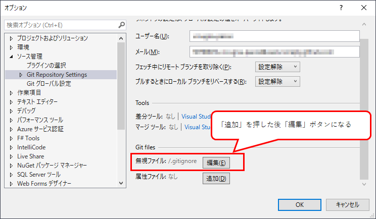

## 前提条件

* Windows 10
* Visual Studio 2019 Community 版

## シングルクリックでのファイルのプレビューを止める

1. メニューの「ツール」→「オプション」をクリック。
1. 左側の「環境」→「タブとウィンドウ」をクリック。
1. 右側の「[プレビュー]タブ」にある「[プレビュー]タブで新しいファイルを開くことを許可する」のチェックを外す。

## .gitignore を追加する
1. Gitリポジトリへの接続があるソリューションを開く。
1. メニューの「Git」→「設定」をクリック。
1. 左側の「Git Repository Settings」をクリック。
1. 右側の「Git files」のカテゴリにある「無視ファイル」の「追加」をクリック。 
1. .gitignore が追加され、Git変更がステージされた状態になる。ファイルの内容は Visual Studio 用のものがすでに書かれている。

## ショートカットキー

参考：[既定のキーボード ショートカット - Visual Studio | Microsoft Docs](https://docs.microsoft.com/ja-jp/visualstudio/ide/default-keyboard-shortcuts-in-visual-studio)

|キー|説明|
|---|---|
|F5|デバッグの開始|
|Ctrl + K, Ctrl + C|選択箇所のコメントアウト|
|Ctrl + K, Ctrl + U|選択箇所のコメント解除|
|Ctrl + Space|コード補完の呼び出し|
|Ctrl + K, Ctrl + D|コード整形 (全体)|
|Ctrl + K, Ctrl + F|コード整形 (選択箇所)|
|Ctrl + K, Ctrl + X|スニペットの挿入|

