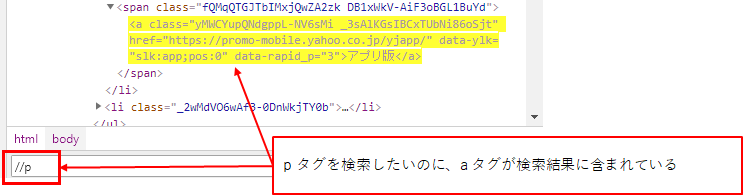
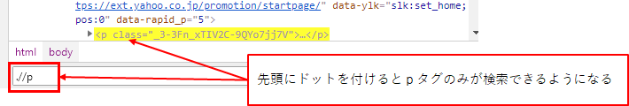
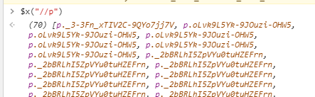

## 参考

[xpath cover page - W3C](https://www.w3.org/TR/xpath/)

[XPath | MDN](https://developer.mozilla.org/ja/docs/Web/XPath)

[クローラ作成に必須！XPATHの記法まとめ - Qiita](https://qiita.com/rllllho/items/cb1187cec0fb17fc650a)

[XPath | TECHSCORE(テックスコア)](https://www.techscore.com/tech/XML/XPath/index.html/)

## サンプル

↓ルート要素からツリー構造を指定。

```
/html/body/h1
```

↓途中までのツリー構造の指定を省略。ツリー構造の途中で使うことも可能。

```
//h1
/html//a
//div//a
```

↓属性名と値を指定。

```
//h1[@class='header1']
```

↓属性名を指定。値は問わない。

```
//h1[@class]
//*[@class]
```

↓指定する文字列が含まれる要素を取得。

```
//h1[contains(@class, 'head')]
```

* 第1引数：文字列が含まれているかどうか調査する対象
* 第2引数：文字列

↓タグ内テキストを検索対象にしたい場合。

```
//h1[contains(text(), '見出し')]
```

ただし、この場合はh1タグ直下のテキストしか対象にならない。例えば、h1タグの中にspanタグがあり、そのspanタグのテキストが「見出し」だった場合は引っかからない。
子or孫要素のテキストまで検索したい場合は、下記のようにする。

```
//h1//*[contains(text(), '見出し')]
```

回りくどい書き方になるが、以下のようにも書ける。

```
//h1/descendant::*[contains(text(), '見出し')]
```

## Chrome での検証方法
1. 開発者ツールを起動する。
1. Element タブを開く。
1. Ctrl + F を押す。
1. 出てきた検索欄に XPath を入力する。
  1. ただし XPath がシンプルな場合、普通の文字検索になってしまうので、先頭に . (ドット) を付けるとよさそう。





他の検証方法もある。

1. 開発者ツールを起動する。
1. Console タブを開く。
1. 入力欄に `$x("調べたいXPath")` と入力してエンターキーを押す。
1. 見つかった要素の一覧が表示される。
1. 一覧のそれぞれにマウスオーバーすると、ページ上のどこにあるかが表示される。また、クリックすると Element タブへ移動し、ソース上のどこにあるかが示される。


