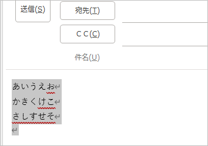
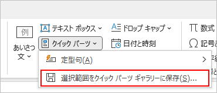
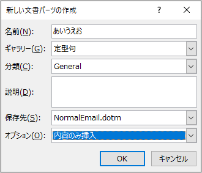
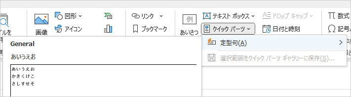
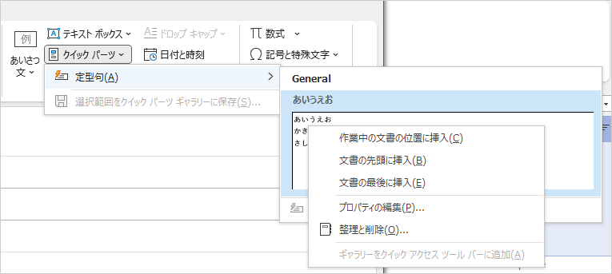

## 概要
Outlook でメールを書いているときに、本文に定型文を使いたいときがある。
そんなときは、「クイックパーツ」が活用できそう。

## 定型文の登録
新しいメールの作成画面で、本文に定型文を書き込む。
文が出来上がったら、該当箇所を選択する。

「挿入」タブ → 「テキスト」 → 「クイックパーツ」 → 「選択範囲をクイックパーツギャラリーに保存」をクリック。

「新しい文書パーツの作成」画面が表示されるので、名前を入力したり、「ギャラリー」を「定型句」に変更したりして「OK」をクリック。

## 定型文を使う
新しいメールを作成する画面で、「挿入」タブ → 「クイックパーツ」 → 「定型句」の中から、目的のものを選ぶ。

## 定型文の編集
定型句の上で右クリックすると、メニューが表示される。

「プロパティの編集」や「整理と削除」で定型句を編集できる。
