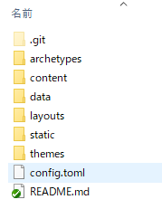
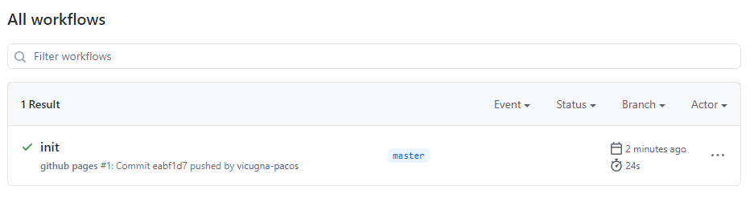
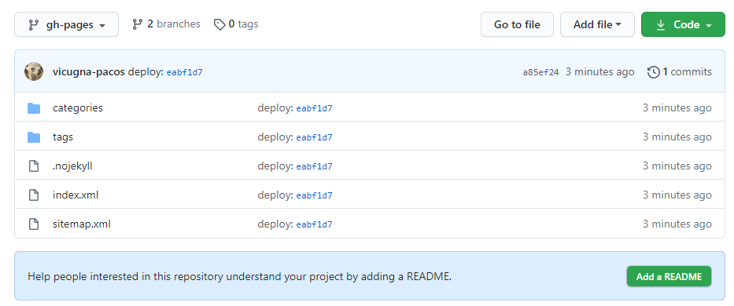
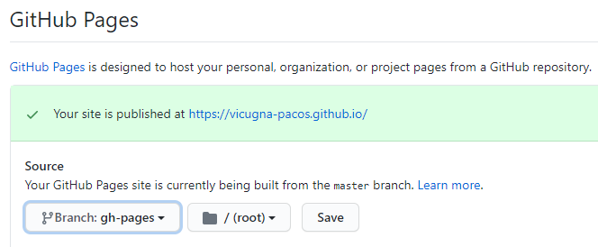

# 前提条件
* Windows 10
* Hugo v0.74.3(Windows版)がPCにインストール済み

# はじめに
GitHub Pagesは所定のリポジトリをJekyllで変換して公開してくれるが、これをHugoを使って公開するようにしたい。
ローカルでHugoのパブリッシュを実行してコミット…という風に手動でやるのは面倒くさいので、mdファイルをコミット＆プッシュしたら、自動的にGitHub Pagesで公開されてほしい。

GitHub Pagesの公開先は`<user>.github.io`とする。

Hugoの使い方については、下記参照。  
[【Hugo】静的Webサイトを作る - Qiita](https://qiita.com/vicugna-pacos/items/d6b5f5cdbc960324a3dc)

# GitHubにリポジトリを作成する
`<user>.github.io`という名前のpublicリポジトリを作成する。自動的にGitHub Pagesのユーザーページ元リポジトリとなる。

# リポジトリをクローン
PCにて、作成したリポジトリをクローンする。

# Hugoで新しいサイトを作る
クローンしたフォルダの親フォルダで下記コマンドを実行。

```
hugo new site [リポジトリのフォルダ名] --force
```

既存フォルダに対しての`new site`なので、フラグの`--force`が必要。
Hugoのフォルダやファイルが作成される。  


その後、テーマを設定しておく。

# GitHub Actionsを設定
[GitHub Actions による GitHub Pages への自動デプロイ - Qiita](https://qiita.com/peaceiris/items/d401f2e5724fdcb0759d)  
上記記事を参考に、ローカルリポジトリで`.github/workflows/gh-pages.yml`を作成し、サンプルをコピペする。

```yml:記事に掲載されているサンプル
name: github pages

on:
  push:
    branches:
      - master

jobs:
  deploy:
    runs-on: ubuntu-18.04
    steps:
      - uses: actions/checkout@v2
        with:
          submodules: true  # Fetch Hugo themes
          fetch-depth: 0    # Fetch all history for .GitInfo and .Lastmod

      - name: Setup Hugo
        uses: peaceiris/actions-hugo@v2
        with:
          hugo-version: '0.74.1'

      - name: Build
        run: hugo --minify

      - name: Deploy
        uses: peaceiris/actions-gh-pages@v3
        with:
          github_token: ${{ secrets.GITHUB_TOKEN }}
          publish_dir: ./public
```

その後コミット＆プッシュする。

プッシュ後GitHubを見に行くと、Actionsが動いたことが分かる。  


また、`gh-pages`という名前のブランチが出来ていて、ここにビルド後のファイルが置かれているのが分かる。  


※ サンプルのスクリプトに`publish_dir: ./public`の記述があるが、ビルド後のファイルはブランチ直下に置かれている。

# 公開元ブランチの変更
既定ではmasterブランチがGitHub Pagesへ公開されるが、これを`gh-pages`へ変更する。

リポジトリの設定画面へ行き、GutHub Pagesの欄を探す。
Sourceのブランチを`gh-pages`、フォルダはルートにしてSaveを押す。  


少し待つとGitHub Pagesの内容が置き換わっている。
表示が変わらない場合はキャッシュが残っている可能性があるので、ブラウザの更新ボタンを押してみるとよい。
