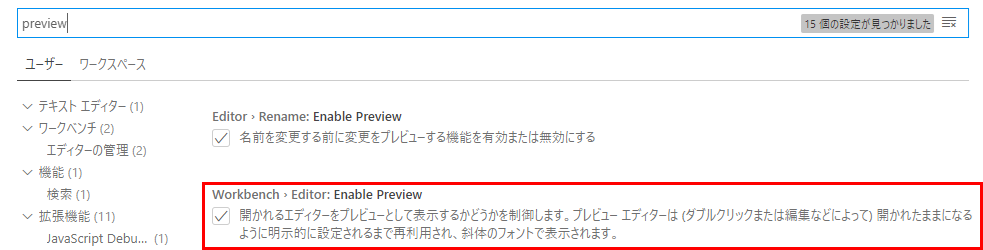
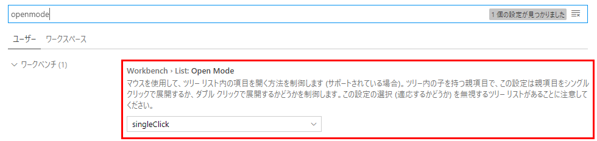
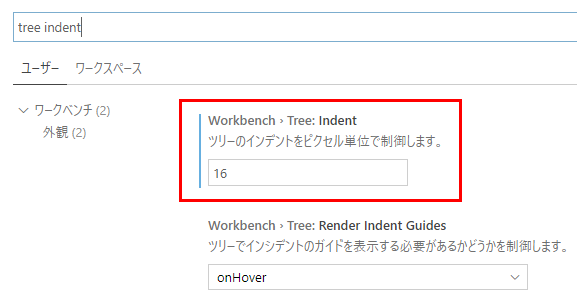

# はじめに
VSCodeの使い方Tips色々

# シングルクリックでファイルが開かないようにする
既定だと、ファイルをシングルクリックするとプレビューモードでファイルが開く(タブのファイル名がイタリックになっている)。
ダブルクリックで普通に開くが、操作しづらいのでプレビューをオフにする。  

プレビューをオフにしただけだと、シングルクリックでファイルが開くのはそのまま。ダブルクリックでファイルを開くように変更する。
設定を「openMode」で検索すると出てくる項目を「doubleClick」にする。  

# エクスプローラーのインデントを変更する
既定のままだと、エクスプローラーのファイルツリーのインデントが浅いが、このインデントの深さは設定で変更できる。
設定を「Tree Indent」で検索して出てくる項目を変更する。
既定値は「8」なので、個人的には「16」などに変更すると良い感じ。  

↓設定値変更前後の様子  

参考：[vs codeでExplorer（ファイルツリー）の階層構造を見やすくする - Qiita](https://qiita.com/toriiico/items/3070bac14946168be1ce)

# Markdownのプレビューを横に表示する
エディタを開いた状態で、`Ctrl` + `K` → `V` を押す(Vを押すときはCtrlキーから手を放す)。
