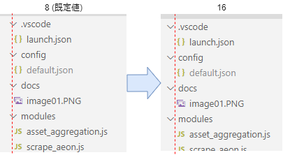

# はじめに
VSCodeの使い方Tips色々

# 設定画面を開く
`Ctrl` + `,` を押す。
または、メニューの「ファイル」→「ユーザー設定」→「設定」。

# シングルクリックでファイルが開かないようにする
既定だと、ファイルをシングルクリックするとプレビューモードでファイルが開く(タブのファイル名がイタリックになっている)。
ダブルクリックで普通に開くが、操作しづらいのでプレビューをオフにする。

`Workbench > Editor > Enable Preview` のチェックを外す。

プレビューをオフにしただけだと、シングルクリックでファイルが開くのはそのまま。ダブルクリックでファイルを開くように変更する。

`Workbench > List > OpenMode` を `doubleClick`にする。

# エクスプローラーのインデントを変更する
既定のままだと、エクスプローラーのファイルツリーのインデントが浅いが、このインデントの深さは設定で変更できる。

`Workbench > Tree > Indent` を変更する。

既定値は「8」なので、個人的には「16」などに変更すると良い感じ。  

↓設定値変更前後の様子  

参考：[vs codeでExplorer（ファイルツリー）の階層構造を見やすくする - Qiita](https://qiita.com/toriiico/items/3070bac14946168be1ce)

# Markdownのプレビューを横に表示する
エディタを開いた状態で、`Ctrl` + `K` → `V` を押す(Vを押すときはCtrlキーから手を放す)。
