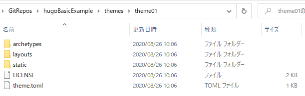
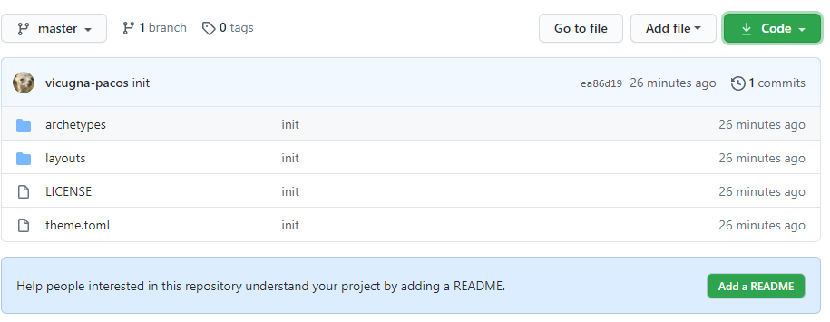

---
title: "Hugoのテーマを作る"
date: 2020-08-26T00:00:00+09:00
tags: ["Hugo"]
draft: true
---

# はじめに
Hugoテーマ自作にチャレンジ。  
Hugo バージョン：v0.74.3

# 準備
## 空のサイトを作る

## 空のテーマを作る
hugoBasicExampleをクローンしたフォルダで、下記コマンドを実行する。

```
hugo new theme [テーマ名]
```

`hugoBasicExample\themes`フォルダに、テーマ名のフォルダが作成される。
また、テーマに必要な基本的なファイルも作成されている。しかしHTMLファイル達は0kbで空っぽである。



## テーマをGitリポジトリにする
テーマ名のフォルダをGitリポジトリにする。
そうすることで、バージョン管理はもとより、他のサイトにもテーマを使えるようになる。



# 使用できる変数
https://gohugo.io/variables/page/

各テンプレートでは、`Page`変数というものが使用できる。
`{{ .Title }}`など、ドットで始まる。

よく使いそうな変数：

* `.Title` - ページのタイトル(front matterに書いたもの)
* `.Content` - ページの内容(front matterの後に書かれたもの)
* `.Date`, `.LastMod`, `.ExpiryDate`, `PublishDate` - front matterに書いた日付。
* `.Draft` - 下書きかどうか(front matter)
* `.Next` - 次のページ。`{{with .Next}}{{.Permalink}}{{end}}`と書けば次ページへのリンクを貼れる。
* `.NextInSection` - 同一セクション内での次ページ。
* `.Pages` - Collection of regular pages and only first-level section pages under the current list page.

# 生成されるファイルについて
空のテーマを作成したときに生成されるファイルについての説明。

|ファイル名|説明|
|---|---|
|`layouts\index.html`|ホームページ(トップページ)|
|`layouts\_default\baseof.html`|全てのページのベースになるファイル。このファイルにはテーマ作成時から内容が書かれている。|
|`layouts\_default\list.html`|セクションページ。|
|`layouts\_default\single.html`|単体ページ|

# baseof.htmlを作る
このファイルが全てのページのベースとなる。
`layouts\_default\baseof.html`を開くと、htmlタグなどが書かれているのが分かる。

```html
<!DOCTYPE html>
<html>
    {{- partial "head.html" . -}}
    <body>
        {{- partial "header.html" . -}}
        <div id="content">
        {{- block "main" . }}{{- end }}
        </div>
        {{- partial "footer.html" . -}}
    </body>
</html>
```
# index.htmlを作る
トップページとなる `layouts\index.html` を開く。内容は空。

## 記事の一覧を表示する
トップページには、メインセクションの記事一覧を表示すると良いと思う。以下はそのサンプル。

```html
{{ define "main" }}
<h1>Posts</h1>
{{ range (where site.RegularPages "Type" "in" site.Params.mainSections) }}
  <article>
    <h2>{{ .Title }}</h2>
    {{ .Content }}
  </article>
{{ end }}
{{ end }}
```

