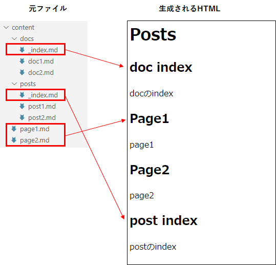

---
title: "Hugoのテーマを作る"
date: 2020-08-26T00:00:00+09:00
tags: ["Hugo"]
draft: true
---

# はじめに
Hugoには様々なThemesが作られているが、あんまりコレダというものが見つけられなかったので、自作にチャレンジ。

# 準備
## 空のサイトを作る

## 空のテーマを作る
hugoBasicExampleをクローンしたフォルダで、下記コマンドを実行する。

```
hugo new theme [テーマ名]
```

`hugoBasicExample\themes`フォルダに、テーマ名のフォルダが作成される。
また、テーマに必要な基本的なファイルも作成されている。しかしHTMLファイル達は0kbで空っぽである。


## テーマをGitリポジトリにする
テーマ名のフォルダをGitリポジトリにする。
そうすることで、バージョン管理はもとより、他のサイトにもテーマを使えるようになる。


# それぞれのファイルの説明
空のテーマを作成したときに生成されるファイルについての説明。

`layouts\index.html` ホームページ(トップページ)
`layouts\_default\baseof.html` 全てのページのベーステンプレート。このファイルにはテーマ作成時から内容が書かれている。
`layouts\_default\list.html`    セクションページ。
`layouts\_default\single.html`  単体ページ

# baseof.htmlを作る
このファイルが全てのページのベースとなる。
`layouts\_default\baseof.html`を開くと、htmlタグなどが書かれているのが分かる。

```html
<!DOCTYPE html>
<html>
    {{- partial "head.html" . -}}
    <body>
        {{- partial "header.html" . -}}
        <div id="content">
        {{- block "main" . }}{{- end }}
        </div>
        {{- partial "footer.html" . -}}
    </body>
</html>
```
# index.htmlを作る
トップページとなる `layouts\index.html` を開く。内容は空。

## 記事の一覧を表示する
↓シンプルな例：

```html
{{ define "main" }}
<h1>Posts</h1>
{{ range .Pages }}
  <article>
    <h2>{{ .Title }}</h2>
    {{ .Content }}
  </article>
{{ end }}
{{ end }}
```

`range .Pages` でページの一覧が取れるが、取得されるのは以下の2つ：

* contents直下にあるmdファイル
* contentsに作成したフォルダにある`_index.md`



