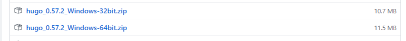

## Hugoとは
静的サイトジェネレータ。MarkdownファイルをHTMLファイルへ変換し、Webサイトにできるツール。  
[公式サイト](https://gohugo.io/)

バージョン：v0.74.3

## 説明の前提条件
Hugoアプリケーションの置場所：`C:\Hugo\bin`  
上記フォルダにPATHを通すので、置場所は違っていても大した問題ではない。

Webサイトのソースの置場所：`C:\Hugo\Sites`  
これも実際はどこでも構わない。

## インストール

Hugoのバイナリを https://github.com/gohugoio/hugo/releases からダウンロードする。
Windows用のバイナリを探してダウンロード。


zipファイルを解凍したら、`C:\Hugo\bin`をPATHに追加する。
もしexeファイルが`hugo.exe`ではない場合、ファイル名を変更しておく。

### 稼働確認
コマンドプロンプトを起動し、`hugo help`と入力する。以下のようなヘルプが出ればOK。 

    hugo is the main command, used to build your Hugo site.

    Hugo is a Fast and Flexible Static Site Generator
    built with love by spf13 and friends in Go.

    Complete documentation is available at http://gohugo.io/.

    Usage:
      hugo [flags]
      hugo [command]

    Available Commands:
      config      Print the site configuration
      convert     Convert your content to different formats
    ※以下略

コマンドプロンプトは、「管理者として実行」しないとhugoコマンドが動作しない場合がある。
(おそらくログオンアカウントの権限による)

## 新しいサイトを作る
コマンドプロンプトで以下を実行。

```
cd C:\Hugo\Sites
hugo new site example.com
```

sitesフォルダ配下に`example.com`というフォルダが作られ、他にも色々フォルダが出来ている。

### 設定ファイルを編集する
サイトフォルダ直下にある`config.toml`をテキストエディタで開くと、以下が既に書かれているので、適切な値へ直す。

```toml
baseURL = "http://example.org/"
languageCode = "en-us"
title = "My New Hugo Site"
```

### ソースをGitに登録する
`example.com`フォルダをGitリポジトリとする。

## テーマを適用する
https://themes.gohugo.io/ へ行って、好きなテーマを探す。
テーマはすべてGitリポジトリにあって、使う場合はsubmoduleとして追加するか、cloneするか、頑張ってダウンロードするかのいずれかで取得する。
テーマを決めたら、`themes`フォルダ内に追加する。

```Batchfile
git.exe submodule add   -- "https://github.com/dim0627/hugo_theme_beg.git" "themes/beg"
```

テーマを追加した後、`config.toml`を編集し、themesフォルダ配下に作ったフォルダ名をテーマ名として指定する。

```toml
theme = "beg"
```

## 新しい記事を書く
以下を実行。

```Batchfile
hugo new <セクション名>/my-first-post.md
```

セクションが無い場合は、指定なしでも良い。
ブログサイトの記事を書くなら、セクション名は`blog`や`posts`がよさそう。
mdファイルは、`content`フォルダ配下に作成される。

### セクション
https://gohugo.io/content-management/sections/

セクションは、`content`フォルダ配下のフォルダ構成で作られる。
既定では、`content`フォルダ直下のフォルダがそのままセクションとなる。
もしさらに深いフォルダをセクションとしたい場合は、そのフォルダの中に`_index.md`を作るとそのフォルダ名がセクションとなる。

    content
    └ blog        <- content直下のフォルダなのでセクションになる
        ├ funny-cats
        │   ├ mypost.md
        │   └ kittens         <- _index.md があるのでセクションになる
        │       └ _index.md
        └ tech                <- _index.md があるのでセクションになる
            └ _index.md

セクションには、メインセクションかどうかの概念もある。  
メインセクションは、多くのテーマでトップページに記事一覧を表示する対象になっていたりする。
既定では、一番ページ数の多いセクションがメインセクションとなる。明確にメインセクションを指定したい場合は、`config.toml`に以下を記述する。

```toml
[params]
  mainSections = ["blog", "docs"]
```


### moreタグを入れる
[Content Summaries | Hugo](https://gohugo.io/content-management/summaries/)

記事中にmoreタグを入れると、一覧画面での記事を途中で分割できる。
これをいれないと、サマリーでHTMLが有効にならない。タグを入れない場合、サマリーがテキストのみになる。

### シンタックスハイライトを使う
[Syntax Highlighting | Hugo](https://gohugo.io/content-management/syntax-highlighting/)

マークダウンで使う` ``` `のほかに、`<highlight>`というHugoのShortcodeも使える。
ハイライトの技術は「Chroma」というGoのライブラリを使っているらしい。
また、「Pygments」というライブラリにも互換性がある。

対応している言語は公式ドキュメントを参照。

#### スタイルを変更する
使用するテーマ次第かもしれないが、コード部分のスタイルは既定では「monokai」という名前で、以下のようになっている。

<pre style="color: #f8f8f2; background-color: #272822" class="chroma"><span style="color: #f92672">package</span> <span style="color: #a6e22e">main</span>
<span style="color: #f92672">import</span> <span class="p">(</span>
    <span style="color: #e6db74">"fmt"</span>
    <span style="color: #e6db74">"math/rand"</span>
    <span style="color: #e6db74">"time"</span>
<span class="p">)</span>
</pre>

スタイルはconfig.tomlで指定可能。

```toml
[markup]
  [markup.highlight]
    style = "monokai"
```

スタイル一覧は、Chroma参照。  
https://xyproto.github.io/splash/docs/all.html

### 見出しはh2から始めるべきか？
通常、何も考えずにMarkdownを書く場合、見出しは`#`(h1)から始めると思う。
しかし、Hugoで記事の目次作成をさせると、`##`(h2)からの見出しを元に目次を作る。
なぜかというと、セマンティック的には`<h1>`はページのタイトルのような最上位のタイトルにつけるものであって、
ページにそう何個も作るものではないから、らしい。

参考：[Semantics (セマンティクス) - MDN Web Docs 用語集: ウェブ関連用語の定義 | MDN](https://developer.mozilla.org/ja/docs/Glossary/Semantics)

ではHugoが`#`から書かれたMarkdownを`<h2>`から始めてくれるかというと、そうなっていない。`<h1>`から始める。設定でカスタマイズする機能もない。
そうすると、Markdownで記事を書くときは、意識して`##`から始めるしかない。ちょっと不便。

目次作成機能については、`#`(h1)から作成するよう設定変更可能なので、こちらで対応するのが落としどころかと思う。

ちなみに、Qiitaの記事を確認したところ、記事タイトルも、レベル1見出しも、両方`<h1>`だった。
あまり深く考えない方がいいのかもしれない…。

## テストする
サイトフォルダ直下で以下を実行。

```
hugo server -D
```

`-D`はdraftsが有効になるオプション。

ブラウザで http://localhost:1313/ にアクセスすると結果が見られる。

## 静的ページを生成する
サイトフォルダ直下で以下を実行。

```
hugo
```

既定では`public`フォルダに生成される。
`-d`オプションを付けるか、設定ファイルに`publishDir`を指定すると、生成先を変えられる。

生成されたフォルダをgitリポジトリとし、GitHub Pages用のリポジトリに登録すれば公開できる。

