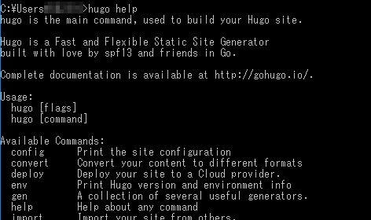

# Hugoとは
静的サイトジェネレータ。MarkdownファイルをHTMLファイルへ変換し、Webサイトにできるツール。  
[公式サイト](https://gohugo.io/)

# 説明の前提条件
Hugoアプリケーションの置場所：`C:\Hugo\bin`  
上記フォルダにPATHを通すので、置場所は違っていても大した問題ではない。

Webサイトのソースの置場所：`C:\Hugo\Sites`  
これも実際はどこでも構わない。

# インストール

Hugoのバイナリを https://github.com/gohugoio/hugo/releases からダウンロードする。
Windows用のバイナリを探してダウンロード。


zipファイルを解凍したら、`C:\Hugo\bin`をPATHに追加する。
もしexeファイルが`hugo.exe`ではない場合、ファイル名を変更しておく。

## 稼働確認
コマンドプロンプトを起動し、`hugo help`と入力する。以下のようなヘルプが出ればOK。  


コマンドプロンプトは、「管理者として実行」しないとhugoコマンドが動作しない場合がある。
(おそらくログオンアカウントの権限による)

# 新しいサイトを作る
コマンドプロンプトで以下を実行。

```
cd C:\Hugo\Sites
hugo new site example.com
```

sitesフォルダ配下に`example.com`というフォルダが作られ、他にも色々フォルダが出来ている。

## 設定ファイルを編集する
サイトフォルダ直下にある`config.toml`をテキストエディタで開くと、以下が既に書かれているので、適切な値へ直す。

```
baseURL = "http://example.org/"
languageCode = "en-us"
title = "My New Hugo Site"
```

## ソースをGitに登録する
`example.com`フォルダをGitリポジトリとする。

# テーマを適用する
https://themes.gohugo.io/ へ行って、好きなテーマを探す。
テーマはすべてGitリポジトリにあって、使う場合はsubmoduleとして追加するか、cloneするか、頑張ってダウンロードするかのいずれかで取得する。
テーマを決めたら、`themes`フォルダ内に追加する。

```Batchfile
git.exe submodule add   -- "https://github.com/dim0627/hugo_theme_beg.git" "themes/beg"
```

テーマを追加した後、`config.toml`を編集し、themesフォルダ配下に作ったフォルダ名をテーマ名として指定する。

```:config.toml
theme = "beg"
```

# 新しい記事を書く
以下を実行。

```
hugo new <セクション名>/my-first-post.md
```

セクションが無い場合は、指定なしでも良い。
ブログサイトの記事を書くなら、セクション名は`blog`や`posts`がよさそう。
mdファイルは、`content`フォルダ配下に作成される。

## セクション
https://gohugo.io/content-management/sections/

セクションは、`content`フォルダ配下のフォルダ構成で作られる。
既定では、`content`フォルダ直下のフォルダがそのままセクションとなる。
もしさらに深いフォルダをセクションとしたい場合は、そのフォルダの中に`_index.md`を作るとそのフォルダ名がセクションとなる。

    content
    └ blog        <- content直下のフォルダなのでセクションになる
        ├ funny-cats
        │   ├ mypost.md
        │   └ kittens         <- _index.md があるのでセクションになる
        │       └ _index.md
        └ tech                <- _index.md があるのでセクションになる
            └ _index.md

セクションには、メインセクションかどうかの概念もある。  
メインセクションは、多くのテーマでトップページに記事一覧を表示する対象になっていたりする。
既定では、一番ページ数の多いセクションがメインセクションとなる。明確にメインセクションを指定したい場合は、`config.toml`に以下を記述する。

```toml
[params]
  mainSections = ["blog", "docs"]
```


## moreタグを入れる
記事中にmoreタグを入れると、一覧画面での記事を途中で分割できる。
これをいれないと、サマリーでHTMLが有効にならない。タグを入れない場合、サマリーがテキストのみになる。

[Content Summaries | Hugo](https://gohugo.io/content-management/summaries/)

# テストする
サイトフォルダ直下で以下を実行。

```
hugo server -D
```

`-D`はdraftsが有効になるオプション。

ブラウザで http://localhost:1313/ にアクセスすると結果が見られる。

# 静的ページを生成する
サイトフォルダ直下で以下を実行。

```
hugo
```

既定では`public`フォルダに生成される。
`-d`オプションを付けるか、設定ファイルに`publishDir`を指定すると、生成先を変えられる。

生成されたフォルダをgitリポジトリとし、GitHub Pages用のリポジトリに登録すれば公開できる。

