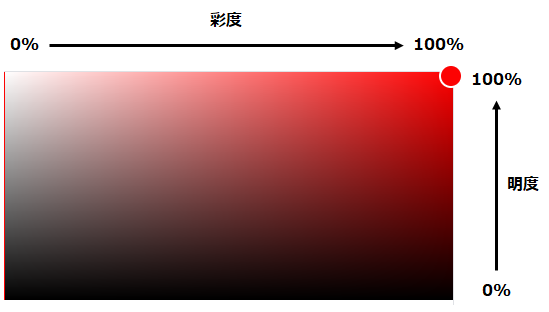

## はじめに
AI-OCRサービスの DX Suite にある画像補正設定の、各設定項目がよく分からなかったので調べてみた。

## カラー画像
カラー原稿をグレースケールへ変換する際に行う補正について設定する。

### フィルタ：色背景除去(HSVモデル)
HSVモデルとは、色相(H)、彩度(S)、明度(V)の3つからなる色空間のこと。
それぞれ、0～255の範囲で、残したい値の範囲を指定する。
既定値は `H=0～255, S=0～200, V=0～180` で、鮮やかで明るい色が除去されるようになっている。

#### 色相(H)
色合いを0～360までの数字にしたもの。
DX Suite では、残したい色相を0～255の範囲で指定する。下記に、両方の場合の数字を大まかに記載した。

参考：[色相 - Wikipedia](https://ja.wikipedia.org/wiki/%E8%89%B2%E7%9B%B8)

#### 彩度(S)と明度(V)
鮮やかさと明るさ。
Google検索で出てくるカラーピッカーを使うと、以下のような感じ。

### 変換：RGB係数
カラー画像をグレースケールへ変換するときの設定値。
既定値は `R=0.299, G=0.587, B=0.114` で、これは「NTSC加重平均法」での重み係数となっている。
カラーをグレーへ変換するときはRGBの平均値を求めるが、上記の重み係数をRGBそれぞれに加えると、より自然に見えるグレー画像が出来上がる。
テレビ放送でも使われている国際規格らしい。

DX Suite で設定できる係数の範囲は0～1なので、例えばRを0にすれば、赤色の部分がより黒く変換される。

参考：

* [グレースケール変換 - IGUNOSS,Inc.](http://www.igunoss.co.jp/imageproc/imageproc1-3.html)
* [より自然なグレースケール変換 - 【ゆるゆるプログラミング】](https://talavax.com/grayscale2.html)

## グレー画像
グレースケール化した画像を二値化する際に行う補正の設定。

### フィルタ：平滑化処理
画像の輝度の変化を滑らかにする処理。ノイズ除去ができる。やり方が、ガウシアン、中間値、平均値、の3パターンがある。ある特定の画素(ピクセル)を中心として、周りの画素とどう比べてどう輝度を直すかが異なる。

### 変換
二値化(白と黒しかない画像)する際の処理方法を指定する。

* マトリックス単位二値化 - 薄い色でも、周りと比較して色が濃いのであれば黒とする、らしい。詳細不明。
* 自動二値化 - 適切な閾値を自動で判定して二値化する。
* 閾値二値化 - 閾値を手動で指定して二値化する。
