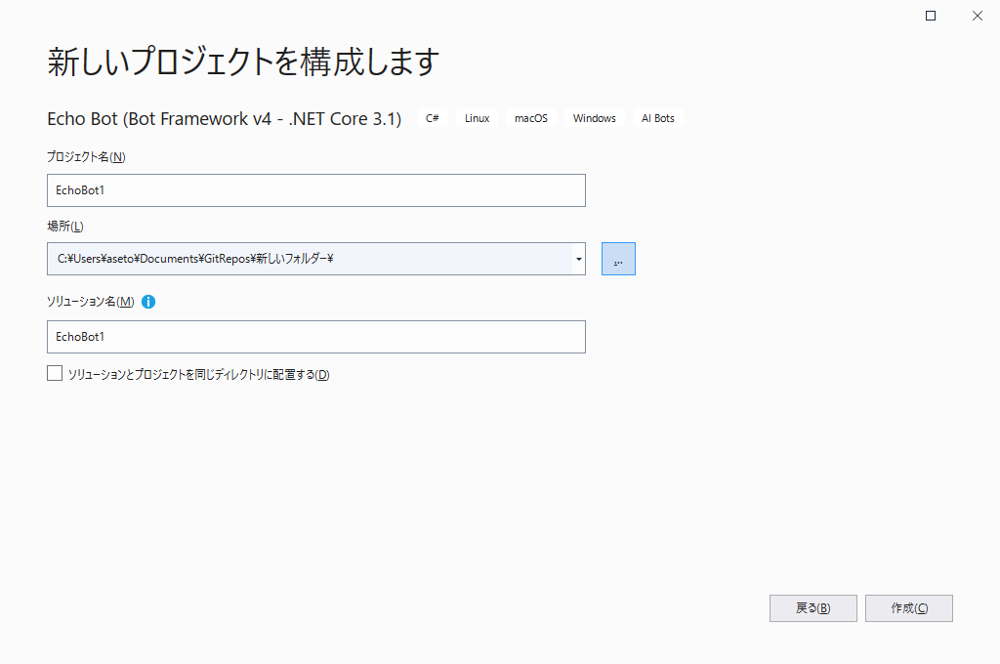

## はじめに
久しぶりに Bot Service について調べてみたら、いろいろ進化していたのでそのメモ。

SDKのドキュメント：[Bot Framework SDK のドキュメント - Bot Service | Microsoft Docs](https://docs.microsoft.com/ja-jp/azure/bot-service/index-bf-sdk?view=azure-bot-service-4.0)

## Virtual Assistant とは
ボットをAzure上で開発する際の、ベストプラクティスを詰め込んだプロジェクトのテンプレート。
つまり、使えばたぶん便利だけど、使わなくても良い。

参考：[What is a Virtual Assistant?](https://microsoft.github.io/botframework-solutions/overview/virtual-assistant-solution/)

## Bot Framework Skills とは
ボットを再利用可能な機能の単位で分けたもの。各ボットから skill を呼び出して利用できる。
Microsoftからすでにいくつかのskillが提供されているが、日本語に対応しているかどうかはskillごとに異なる。おそらくほとんど対応していない。

参考：[What is a Bot Framework Skill?](https://microsoft.github.io/botframework-solutions/overview/skills/)

## 前提条件

* Visual Studio 2019 Community 版で開発

参考：[Bot Framework SDK for .NET を使用したボットの作成 - Bot Service | Microsoft Docs](https://docs.microsoft.com/ja-jp/azure/bot-service/dotnet/bot-builder-dotnet-sdk-quickstart?view=azure-bot-service-4.0&tabs=vs)

## Bot Framework v4 SDK Templates をインストール

1. Visual Studioを起動し、メニューの「拡張機能」→「拡張機能の管理」をクリック。
1. 「Bot Framework v4 SDK Templates for Visual Studio」を検索し、ダウンロード。
1. Visual Studioを終了し、インストールを実行させる。
1. 再度 Visual Studioを起動する。

## 新しいプロジェクトの作成
Visual Studioのメニューの「ファイル」→「新規作成」→「プロジェクト」をクリック。
テンプレートとして、「Echo Bot (Bot Framework v4 - .NET Core 3.1)」を選ぶ。※.NET Core 2.1を選ばないように注意。

