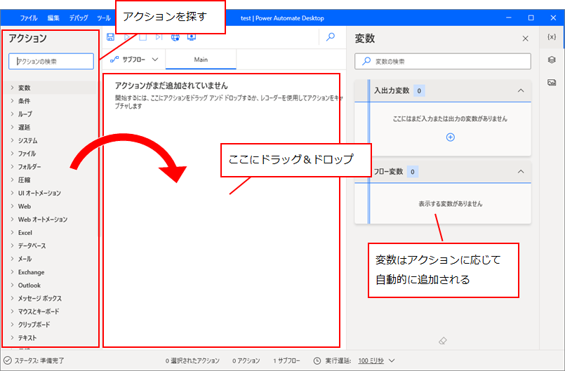
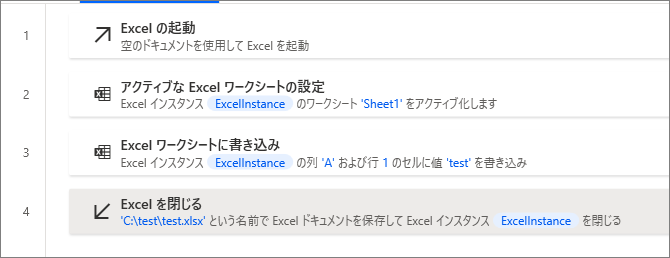
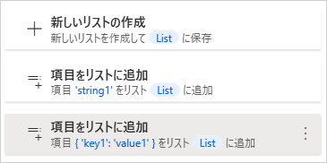
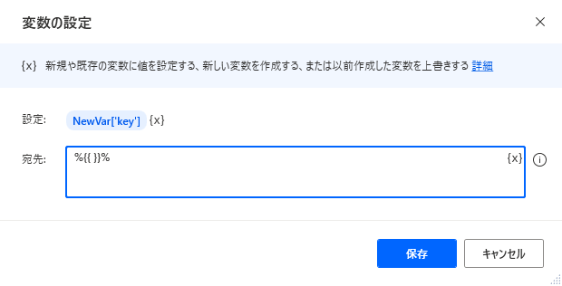
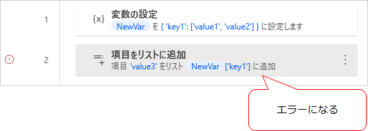

## インストール
https://flow.microsoft.com/ja-jp/desktop/

上記URLへアクセスし、アプリをダウンロードしてインストールする。
Windows 10 ユーザーであれば無料で利用できるが、以下の条件がある。

* 他のオンラインで使う Microsoft 製品 (例えば Power Automate のクラウドフローとか？) を使ったことがない場合は、サインアップ (利用登録) が必要。
* Power Automate Desktop で作るフロー (デスクトップフロー) は個人アカウントに保存され、他人と共有はできない。
  * 他人とフローを共有し、組織内で働く RPA として開発したい場合は有料プランが必要。

## 画面構成

フロー内で使う変数は、アクションの出力結果などとして自動的に定義されることが多い。
自分で変数を定義したい場合は、「変数の設定」アクションを使用する。

## Excel の操作
基本の流れは下記の通り。

1. Excel を起動
1. 読み書きしたいシートをアクティブにする
1. セルの値を読み書きする
1. Excel を終了

特徴として、操作対象になるシートを逐次アクティブ化する必要がある。

下記は、新しい Excel ファイルを作成し A1 セルに「test」と書き込むサンプル。

Excel を終了する際にファイルパスを指定して保存している。

### セル/範囲の読取
「Excel ワークシートから読み取り」アクションを使用する。このアクションで、単一のセル・範囲指定 の両方の読み取りができる。
他のアクションにも見られる特徴だが、単一セルを読むか範囲を読むかによって、出力される変数の型が変わる。

## 変数の型
参考：[Variable data types - Power Automate | Microsoft Docs](https://docs.microsoft.com/en-us/power-automate/desktop-flows/variable-data-types)

### リスト
一次元配列。

配列の各要素 (PADでは項目と表記) には色々な型を設定できる。カスタムオブジェクトも入れられる。
また、要素の型がバラバラでもよい。1番目に文字列を入れ、2番目にカスタムオブジェクトを入れる…ということもできる (やらない方がよいが)。

リストの項目の操作は、それぞれ専用のアクションを使う。

空のリストに対して、 `%List[2]%` に直接代入…ということはできない。

### データテーブル
列と行からなる形式。列には名前が付けられる。

データテーブルの書き方：

* `%{}%` ： 空のデータテーブル
* `%{ ^['header1', 'header2'] }%` ： 列名だけ定義している
* `%{ ^['header1', 'header2'], ['value1', 'value2'] }%` ： 列名とデータを1行定義している
* `%NewVar + ['value3', 'value4']%` ： 既存のデータテーブルに行追加
* `%NewVar[1]['header1']%` ： 特定の位置にある値を参照。値の設定先にも指定できる。

上記のように新しいデータテーブルを定義したり行を追加したりはできるが、定義済みのデータテーブルに対して、列の追加、列の削除、行の削除はできない。
その場合は、別のデータテーブルを作ってデータを移すか、[Excelに一時的に書き込んでExcel上で編集する](https://docs.microsoft.com/en-us/power-automate/desktop-flows/how-to/delete-row-column-datatable)といい。

### カスタムオブジェクト
JSONの記法で任意のキーと値を持ったオブジェクトを作れる。

カスタムオブジェクトの書き方：

* `%{{ }}%` ： 空のオブジェクト
* `%{NewVal['key1']:'value1'}%` ： 決まったキーと値がある場合
* `%{NewVal[key1]:value1}%` ： シングルクォーテーションがない場合は変数とみなされる

「変数の設定」アクションで、「設定」を `%{NewVal['key1']}%` という風にすると、新しいキーと値を追加できる。 

また、`%{ 'key1': ['value1', 'value2'] }%` のように配列を含めることもできるが、配列に対して項目を増減できない。

連続データを扱いたい場合は、素直にデータテーブルかリストを使う方がよさそう。

### その他の型
ブラウザインスタンスとか、特定のアクションで取得できる変数の型がある。それらも含めた型とプロパティは、下記ドキュメントを参照。

参考：[Datatype properties - Power Automate | Microsoft Docs](https://docs.microsoft.com/en-us/power-automate/desktop-flows/datatype-properties)