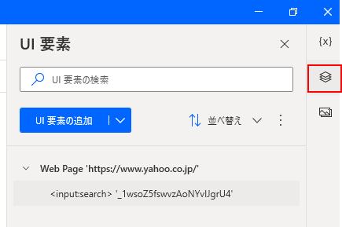
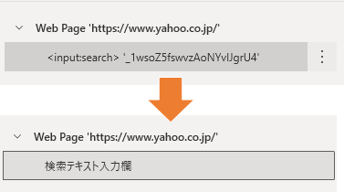

## 基本
アクションは「ブラウザー自動化」の中にある。

## UI要素の管理
アクションごとにUI要素を指定するのではなく、フロー全体で一括してUI要素を管理し、それをアクションで使うイメージ。各アクションで「UI要素の追加」ができるが、セレクタの編集などは、画面右側の「UI要素」のエリアで行う。

UI要素はセレクタとは別に、名前を付けられる。

名前を付けておくとわかりやすくなる。

## UI要素のセレクタ
ブラウザ上のUI要素を指定するときは、Ctrl キーを押しながら目的の要素をクリックする。
このとき、マウスオーバーしたときだけ class 属性を変えるような要素だったりすると、そのフローをいざ実行したときに「要素が見つからない」というエラーになる。そういう場合は、セレクタを編集する必要がある。

もしくは、そのUI要素をクリック等する前に、「Webページの要素にマウスをホバーします」アクションを使い、UI要素を指定した時と同じ状況を作り出すのも解決方法だと思われる。
