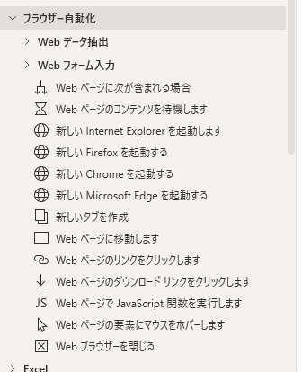
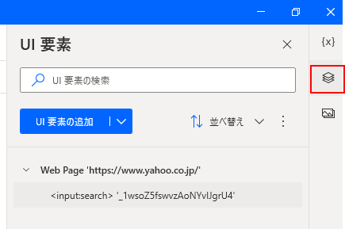
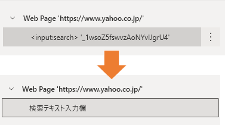
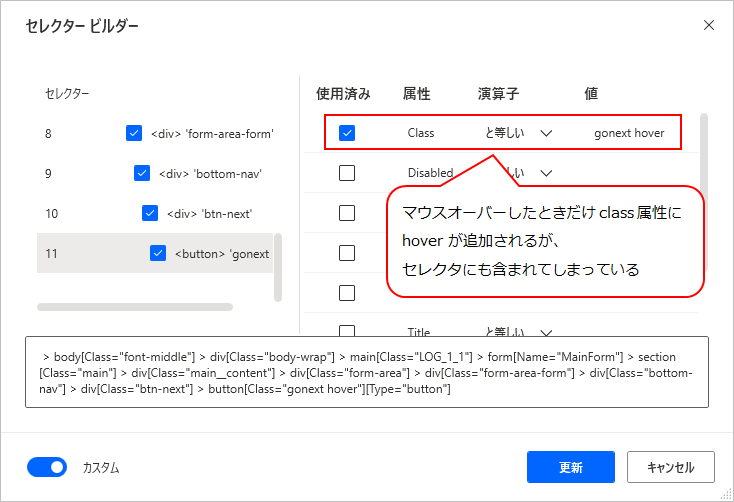
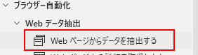
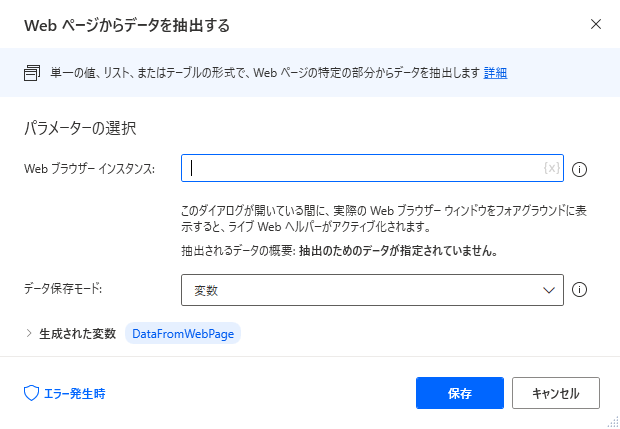
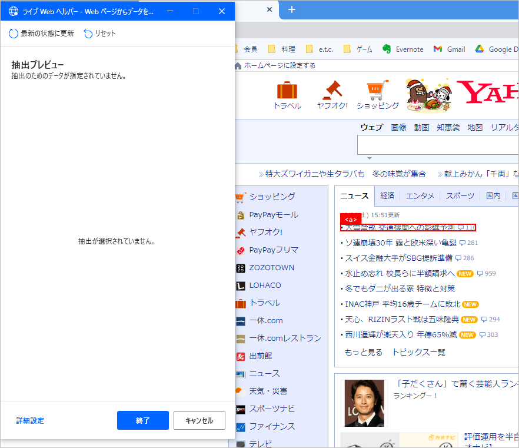
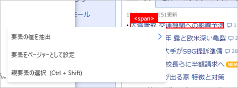

## 基本
アクションは「ブラウザー自動化」の中にある。

## UI要素の管理
アクションごとにUI要素を指定するのではなく、フロー全体で一括してUI要素を管理し、それをアクションで使うイメージ。各アクションで「UI要素の追加」ができるが、セレクタの編集などは、画面右側の「UI要素」のエリアで行う。

UI要素はセレクタとは別に、名前を付けられる。

名前を付けておくとわかりやすくなる。

## UI要素のセレクタ
ブラウザ上のUI要素を指定するときは、Ctrl キーを押しながら目的の要素をクリックする。
このとき、マウスオーバーしたときだけ class 属性を変えるような要素だったりすると、そのフローをいざ実行したときに「要素が見つからない」というエラーになる。そういう場合は、セレクタを編集する必要がある。

もしくは、そのUI要素をクリック等する前に、「Webページの要素にマウスをホバーします」アクションを使い、UI要素を指定した時と同じ状況を作り出すのも解決方法だと思われる。

## データ抽出のやり方

Webページから値を取得するには、「Webページからデータを抽出する」を使う。単一の値、テーブル形式など様々な形で値を取得できる。
ただ、このアクションの操作方法が少し独特なので記載しておく。

まず、ブラウザを起動し値を取得したいWebページを開いておく。

アクションをフローへドラッグ＆ドロップ(もしくはダブルクリック)した後、設定画面が現れる。

この状態でブラウザを最前面にすると、「ライブWebヘルパー」が表示され、マウスカーソルがあるところの要素の情報が表示されるようになる。

値を取得したい要素にマウスを置き、__右クリック__ するとどのように値を取得するか選ぶメニューが表示される。

この後は抽出する形式などを選べばよい。
