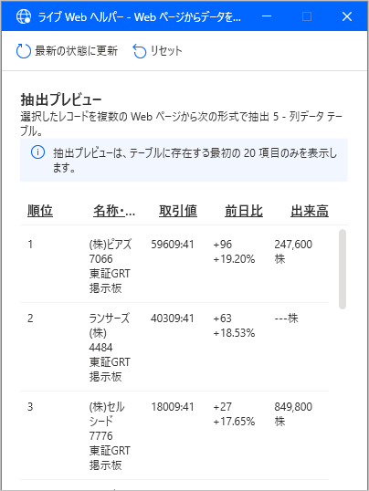

## 基本
Power Automate Desktop でのブラウザ操作について。

アクションは「ブラウザー自動化」の中にある。

## UI要素の管理
アクションごとにUI要素を指定するのではなく、フロー全体で一括してUI要素を管理し、それをアクションで使うイメージ。各アクションで「UI要素の追加」ができるが、セレクタの編集などは、画面右側の「UI要素」のエリアで行う。

UI要素はセレクタとは別に、名前を付けられる。

名前を付けておくとわかりやすくなる。

## UI要素のセレクタ
ブラウザ上のUI要素を指定するときは、Ctrl キーを押しながら目的の要素をクリックする。
このとき、マウスオーバーしたときだけ class 属性を変えるような要素だったりすると、そのフローをいざ実行したときに「要素が見つからない」というエラーになる。そういう場合は、セレクタを編集する必要がある。

もしくは、そのUI要素をクリック等する前に、「Webページの要素にマウスをホバーします」アクションを使い、UI要素を指定した時と同じ状況を作り出すのも解決方法だと思われる。

## データ抽出のやり方

Webページから値を取得するには、「Webページからデータを抽出する」を使う。単一の値、テーブル形式など様々な形で値を取得できる。
ただ、このアクションの操作方法が少し独特なので記載しておく。

まず、ブラウザを起動しデータを抽出したいWebページを開いておく。

次に、Power Automate Desktop の画面へ戻り、「Webページからデータを抽出する」アクションをフローへドラッグ＆ドロップ(もしくはダブルクリック) する。
そうすると、アクションの設定画面が現れる。

この状態でブラウザを最前面にすると、「ライブWebヘルパー」が表示され、マウスカーソルを乗せたところが赤枠で囲まれるようになる。

データを抽出したい要素にマウスを置き、__右クリック__ するとどのように値を取得するか選ぶメニューが表示される。

例えばテキストを抽出したいときは「テキスト」をクリックする。するとライブWebヘルパーにプレビューが追加される。

単一の値であれば、ここで終了ボタンを押して Power Automate Desktop の画面へ戻る。

### 連続データの抽出

このアクションはテーブルやリストなど、連続したデータの抽出にも対応している。

tableタグの場合、table内のいずれかのセルを抽出しようとすると、右クリックしたときに「HTMLテーブル全体を抽出する」の選択項目が出る。

これをクリックすると、テーブル全体が抽出される。

テーブルのヘッダー行が th タグで作られている場合は、抽出後の列名にヘッダーが設定される。

tableタグ以外で作られた連続データの場合は、1件目と2件目を続けて抽出すると、自動的に連続データだと判定してくれる。

ニュースのトピックを例にする。
下図が1件目のトピックを抽出した状態。

この後、2件目のトピックを同じように抽出する。

すると、3件目以降も自動的に枠が付く。

Power Automate Desktop が自動的に連続データを判別している。

連続データが複数ページにわたる場合、「次へ」リンクを「要素をページャーとして設定」する。そうすると、「次へ」リンクが押せる限り、次のページのデータも抽出する。

### 詳細設定
PAD が自動的に作ってくれる抽出設定では上手く行かない場合、「詳細設定」から自分でセレクタを設定できる。

詳細設定では、「抽出」の種類によって指定するセレクタの種類が変わる。

#### テーブル

「基本CSSセレクタ」に、テーブルの行にあたる要素を指定する。基本的に行は複数あるので、その行がすべて取れるようなセレクタにする。

その下にテーブルの列にあたる要素を複数指定できる。列にあたる要素のCSSセレクタは、「基本CSSセレクタ」を起点としたセレクタを指定する。

#### HTMLテーブル全体

## 新しいウィンドウが開くとき
自動化したい操作の途中で、新しいウィンドウが開く場合のフローの作り方。

新しいウィンドウが開き、そっちを操作したい場合は「新しい Chrome を起動する」などブラウザを起動するアクションを使う。

* 起動モード ： 「実行中のインスタンスに接続する」
* Chromeタブに接続する ： いずれかを選択する

ウィンドウを探す方法は、ページタイトル、URL、フォアグラウンドウィンドウ (最前面のウィンドウ) のいずれか。
新しいウィンドウが開いた直後であれば、とりあえずフォアグラウンドウィンドウでいいかもしれない。

このアクションで接続したウィンドウは新しいインスタンス変数に保存されるので、これ以降、新しいウィンドウでの操作は新しい方のインスタンス変数を指定する。
