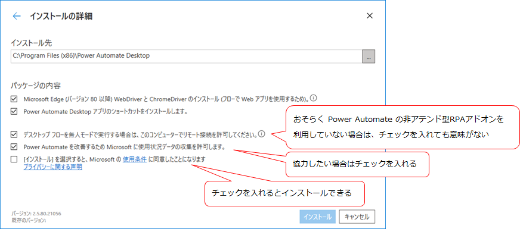
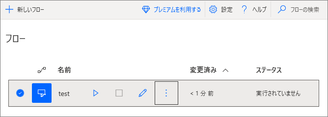
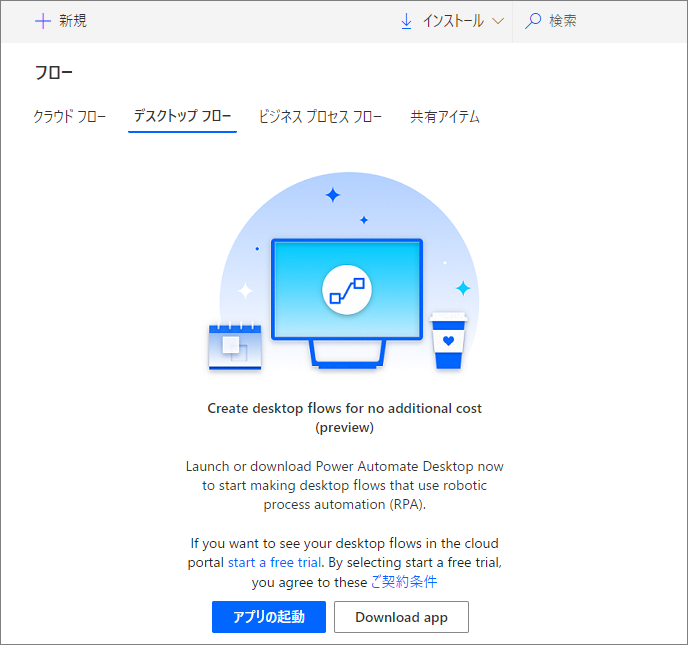
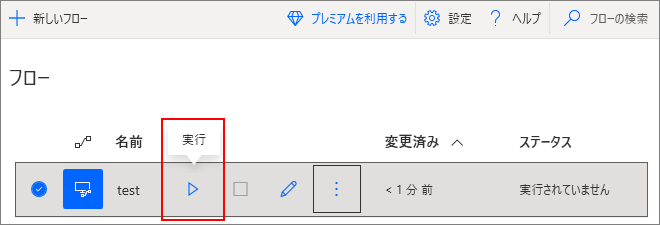
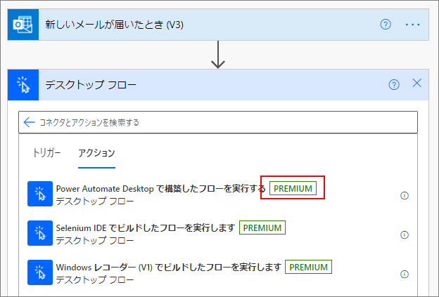

## はじめに
参考：
* [Automate tasks with Power Automate Desktop for Windows 10—no additional cost | Power Automate Blog](https://flow.microsoft.com/en-us/blog/automate-tasks-with-power-automate-desktop-for-windows-10-no-additional-cost/)

Windows 10 ユーザーは追加料金なしで Power Automate Desktop を利用できるようになった。
これだけ聞くと他RPA製品を駆逐する勢いを感じるが、実際はどうなのか、試しに触れてみた。

前提条件：

* 職場の組織アカウントから利用
* Power Automate の有料プランの契約無し

## インストール
[公式サイト](https://flow.microsoft.com/ja-jp/desktop/) でアプリケーションをダウンロードしてインストールする。

インストールの途中、「インストールの詳細」でオプションを選ぶことになるが、「無人モード」で実行するか否かは、おそらく Power Automate の非アテンド型RPAアドオン(有償) を利用していないと意味がない。

インストールが完了すればアプリケーションが利用可能になる。

## フローはどう管理されるか
Power Automate では、自動化の作業の単位を「フロー」という。
Power Automate Desktop でフローを作成すると、フロー一覧画面 ([ドキュメント](https://docs.microsoft.com/en-us/power-automate/desktop-flows/console)ではコンソールと呼んでいる) に表示される。

フローはクラウド上へ保管されているが、ではブラウザ版の Power Automate のページから同じ一覧が見えるかというと、そうなっていない。デスクトップフローのページを見ると、アプリケーションの起動を促される。

デスクトップフローは、Power Automate Desktop をインストールした PC と該当アカウントからしか確認できない。つまり作った人しかフローを使えない。

フローを複製して他人に渡す機能も、今のところ見当たらない。
クラウドフローはインポート＆エクスポートができるが、デスクトップフローにはない。

## フローの実行方法
手動で Power Automate Desktop を起動し、フローの実行ボタンを押す必要がある。

クラウド上で動作する「クラウドフロー」からデスクトップフローを実行するには、有償版が必要。

## 他製品を駆逐するか？
Power Automate Desktop は、個人が自分の作業を自動化するだけなら無償で行えるようになった。対して、組織でRPA推進プロジェクトを立ち上げて組織内の作業を自動化しようとする場合は、やはり有償プランの契約が必要だろう。
元々 WinActor や UiPath などは組織をターゲットにしているため、これらの製品がすぐさま駆逐されるとは考えづらいかもしれない。
しかし、Power Automate の価格は [価格](https://flow.microsoft.com/ja-jp/pricing/) のページを見る限り他製品より安いので、比較検討するなら対象に含めた方がいいと思う。特に、組織で Microsoft 365 を利用している場合の魅力度は高い。

まぁ、大規模にRPAを導入・運用することに労力を割くくらいなら、システム化など別の方法を検討したほうがいい気もするが…。