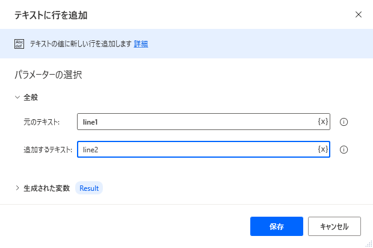
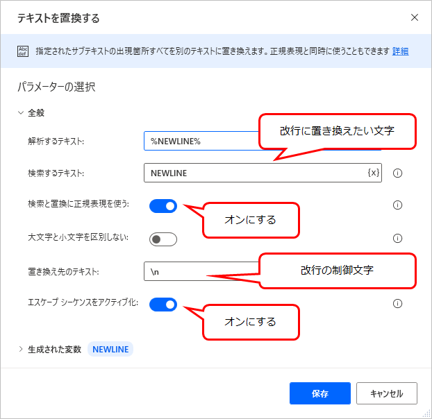

## 現象
Power Automate Desktop には、タブや改行を表すコードがない。
改行コードは「テキストに行を追加」で挿入できる。

ただこのステップで追加されるのは `\r\n` であり、 `\n` だけ追加することはできない。

## 解決策
「テキストを置換する」で正規表現を使い、任意の文字列を制御文字へ置き換える。

「検索と置換に正規表現を使う」と「エスケープシーケンスをアクティブ化」をオンにする。「検索するテキスト」は、制御文字へ置き換えたい文字列を指定する。この文字列はフローを通して自分で決めておく必要があり、他の文字がうっかり制御文字へ置き換わってしまわないような文字列にする。
「置き換え先のテキスト」で制御文字を指定する。改行であれば `\r\n` または `\n` (どちらが適しているかはテキストをどこで使うかによる)、タブであれば `\t` となる。
