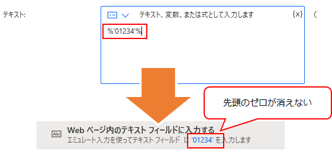

## 概要
Power Automate Desktop を使って気づいたことのメモ

## 先頭のゼロが消えてしまう
例えばテキストフィールドへの入力のステップを作る際、数字のみのテキストを入力させようとすると、先頭にゼロがあっても確定した後に消えてしまう。

おそらく自動的に数字と判断され、削除されているのだと思う。
これを文字であると明示するには、 `%'01234'%` のように式の形式で書く必要がある。

