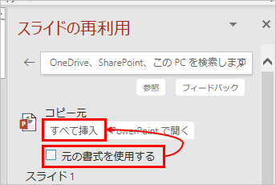

## スライドマスターを入れ替える
既存のpptxファイルのスライドマスターを、新しいスライドマスターへ変えたいときの手順。

1. 古いスライドマスターのpptxファイルを用意する。(コピー元)
1. 新しいスライドマスターのpptxファイルを用意する。(コピー先)
1. コピー先ファイルを開く。
1. 「ホーム」タブ → 「スライドの再利用」をクリック。もしくは「挿入」タブにも「スライドの再利用」がある。
1. 画面右側の「参照」ボタンをクリック。 
1. 「元の書式を利用する」のチェックを外し、「すべて挿入」をクリック。スライドを個別に選びたい場合は、下部にスライドの一覧が表示されているので、挿入したいものを選ぶ。 
1. コピー先ファイルにスライドが取り込まれる。

* スライドのレイアウトがコピー先のものに上手く変わっていないことがあるので、1枚ずつ確認してスライドのレイアウトを変える。
* 個別の書式設定を解除したい場合は、スライドの「リセット」をクリック。
