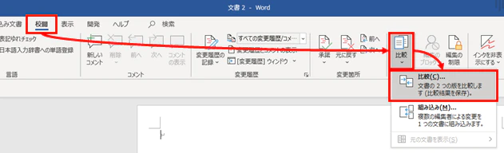
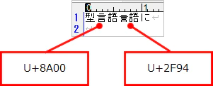

## はじめに
Wordファイルに対して、Unicode正規化を実施するスクリプトのサンプル。

* Windows 10
* PowerShell v5.1
* Word のバージョンは Office 365

### 何があったか
あるとき、契約書の類いの文書に更新があり、差分をチェックする必要が出た。
提供された形式はpdfだったので、Wordへ変換し、タブ「校閲」→「比較」から比較を実施した。



すると、ぱっと見同じ文字なのに、変更ありとマークされている字がちらほら見つかった。


サクラエディタに該当箇所をコピペしてみると、文字コードが違うことが分かった。こっちだと、見た目が違うので分かりやすい。



原因としては、MacOSで文書を作成した場合、使用するアプリケーションによってUTF-8でも使うコードが違うことがある、というのが考えられるらしい。
対応方法としては、文書作成元へ問い合わせるのが一番だが、せっかくなので(？)コードでなんとかしてみた。

## サンプル
パラメータで指定されたdocxファイルを正規化する。
docxファイルはZip形式なので、それを解凍し、中にある`word\document.xml`ファイルを正規化して上書きする。
その後、圧縮しなおして新しいdocxファイルとする。

```powershell

Param($filePathDocx)

Add-Type -AssemblyName System.IO.Compression.FileSystem

# パラメータで指定されたファイルを正規化

# 拡張子チェック
if ($filePathDocx -eq $null -or -not $filePathDocx.EndsWith(".docx")) {
    Write-Host "[エラー] docxファイルではありません"
    return
}

# 正規化後ファイルパス
$filePathDocxOut = $filePathDocx.Replace(".docx", "_正規化.docx")

if (Test-Path $filePathDocxOut) {
    Remove-Item $filePathDocxOut
}

# docx解凍
$extractDir = [System.IO.Path]::GetTempPath() + "\word_extract_" + (Get-Date -Format yyyyMMddHHmmss)

[System.IO.Compression.ZipFile]::ExtractToDirectory($filePathDocx, $extractDir)

# document.xmlの正規化
$docFilePath = "${extractDir}\word\document.xml"
$tmpFilePath = [System.IO.Path]::GetTempFileName()

[System.IO.File]::Copy($docFilePath, $tmpFilePath, $true)

$reader = $null
try {
    $reader = New-Object System.IO.StreamReader($tmpFilePath)
    
    $writer = $null
    try {
        $writer = New-Object System.IO.StreamWriter($docFilePath, $false, [System.Text.Encoding]::UTF8)
        $line = $reader.ReadLine()

        while ($line -ne $null) {
            $line = $line.Normalize([System.Text.NormalizationForm]::FormKC)
            $writer.WriteLine($line)

            $line = $reader.ReadLine()
        }
        
    } finally {
        if ($writer -ne $null) {
            $writer.Close()
        }        
    }

} finally {
    if ($reader -ne $null) {
        $reader.Close()
    }
}

# 圧縮
[System.IO.Compression.ZipFile]::CreateFromDirectory($extractDir, $filePathDocxOut)

# 後片付け
[System.IO.Directory]::Delete($extractDir, $true)
[System.IO.File]::Delete($tmpFilePath)

Write-Host "done"
```
