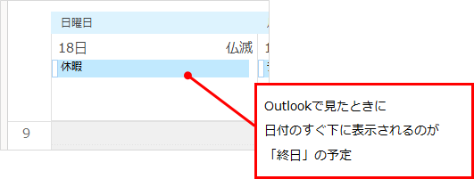

## はじめに
PowerShellでVBAみたいなことができる Outlook版。

## 前提条件

* PowerShell v5.1
* Outlook 365

## 起動と終了

```powershell
function main() {
    # 起動済みのOutlookがあるか確認
    $outlookProcess = Get-Process -Name "OUTLOOK" -ErrorAction SilentlyContinue
    $needQuit = $false
    if ($outlookProcess -eq $null) {
        $needQuit = $true
    }

    $outlook = New-Object -ComObject Outlook.Application
    try {
        $namespace = $outlook.GetNamespace("MAPI")

        # ここに色々処理を書く

    } finally {
        if ($needQuit) {
            [void]$outlook.Quit()
            [void][System.Runtime.Interopservices.Marshal]::ReleaseComObject($outlook)
        }
    }
}
```

### 起動済みOutlookの確認
Outlookの場合、起動するインスタンスは常に1つらしい。
Outlookが起動した状態でスクリプトを実行すると、スクリプトは起動済みのOutlookを使うので、処理の最後に起動していたOutlookが終了してしまう。
それを避けるために、インスタンス取得の前にプロセスを確認し、起動しているOutlookがある場合は、最後に終了させないようにした方が良いかもしれない。
(便利スクリプト起動のたびにOutlookが終了したら便利ではないため)

## 受信トレイや予定表の取得

```powershell
# 目的に合わせてフォルダ取得
# 予定表
$folder = $namespace.GetDefaultFolder($OlDefaultFolders::olFolderCalendar)
# 連絡先
$folder = $namespace.GetDefaultFolder($OlDefaultFolders::olFolderContacts)
# 下書き
$folder = $namespace.GetDefaultFolder($OlDefaultFolders::olFolderDrafts)
# 受信トレイ
$folder = $namespace.GetDefaultFolder($OlDefaultFolders::olFolderInbox)
# タスク
$folder = $namespace.GetDefaultFolder($OlDefaultFolders::olFolderTasks)
# To Do
$folder = $namespace.GetDefaultFolder($OlDefaultFolders::olFolderToDo)
```

`GetDefaultFolder`を使用しない場合は、`$namespace.Folders`をあさって目的のフォルダを取得する。
フォルダ階層は、以下のようになっている(※Office365のメールアカウントの場合)。

* パブリックフォルダ
* 自分のメールアカウント(フォルダ名はメールアドレス)
    * 受信トレイ
    * 予定表
    * タスク　等
* 共有メールアカウント(フォルダ名はアカウント名)
    * 受信トレイ
    * 予定表
    * タスク　等

## 特定のフォルダを取得

```powershell
<#
aaa@example.com\受信トレイ\テストフォルダ　など\区切りで指定したフォルダを取得する
必要な変数：
 $namespace
#>
function getFolder($folderName) {
    $names = $folderName.Split("\")
    $folders = $namespace.Folders
    $result = $null

    foreach ($name in $names) {
        $result = $null

        foreach ($folder in $folders) {
            if ($folder.Name -eq $name) {
                $result = $folder
                $folders = $folder.Folders
                break
            }
        }
    }

    return $result
}
```

## フォルダ内のアイテムを取得
メールの場合、MailItem
予定表の場合、AppointmentItem

### すべてのアイテムを取得

```powershell
foreach ($item in $folder.Items) {
    Write-Host $item.Subject
}
```

### フィルターを使う
フィルターを使うと、例えば「件名が●●のアイテム」を抽出したりできる。

```powershell
$items = $folder.Items.Find()    # 条件に一致するItemを1件だけ返す
$items = $folder.Items.Restrict()    # 条件に一致するItemを全件返す
```

フィルター構文については下記参照。
[【Outlook VBA】メールや予定をフィルターで検索する - Qiita](https://qiita.com/vicugna-pacos/items/977fd4c32ebe0486869b)

## 終日の予定を作る
「終日」の予定とは、時間指定がない予定のこと。



参考：[終日イベントの予定を作成する | Microsoft Docs](https://docs.microsoft.com/ja-jp/office/client-developer/outlook/pia/how-to-create-an-appointment-that-is-an-all-day-event)

終日の予定を作るための要件は、下記の通り：

* `AllDayEvent`を`true`にする
* `Start`は開始日の0時を指定
* `End`は終了日の次の日の0時を指定する

下記のサンプルでは、2020年1月1日に終日の予定を作成している。

```powershell
# アセンブリのロード
[void][Reflection.Assembly]::LoadWithPartialName("Microsoft.Office.Interop.Outlook")

# 列挙型を変数に入れておく
$OlDefaultFolders = [Microsoft.Office.Interop.Outlook.OlDefaultFolders]
$OlItemType = [Microsoft.Office.Interop.Outlook.OlItemType]
$OlBusyStatus = [Microsoft.Office.Interop.Outlook.OlBusyStatus]

# --- 中略 ---

$folder = $namespace.GetDefaultFolder($OlDefaultFolders::olFolderCalendar)

$date = [DateTime]::ParseExact("20200101", "yyyyMMdd", $null)

$newItem = $outlook.CreateItem($OlItemType::olAppointmentItem)
$newItem.Subject = "終日の予定"
$newItem.Start = $date
$newItem.End = $date.AddDays(1)
$newItem.AllDayEvent = $true
$newItem.BusyStatus = $OlBusyStatus::olFree  # 空き時間
$newItem.Save()
```

## AppointmentItem (予定アイテム)
https://docs.microsoft.com/ja-jp/office/vba/api/outlook.appointmentitem

### プロパティ

* `Subject` (文字) 件名
* `Start` (日付) 開始日時
* `End` (日付) 終了日時
* `AllDayEvent` (Boolean) 終日かどうか
* `Body` (文字) 本文
* `BusyStatus` (`OlBusyStatus`) 予定の公開方法
  * `olBusy` (2) 予定あり
  * `olFree` (0) 空き時間
  * `olOutOfOffice` (3) 外出中
  * `olTentative` (1) 仮の予定
  * `olWorkingElsewhere` (4) 他の場所で作業中
* `ReminderSet` (Boolean) リマインダーを付けるかどうか
* `ReminderMinutesBeforeStart` (数値) 何分前にリマインダーを鳴らすか
* `Duration` (long) 所要時間(分)
* `Importance` (`OlImportance`) 重要度
  * `olImportanceHigh` (2)
  * `olImportanceLow` (0)
  * `olImportanceNormal` (1)
* `IsRecurring` (Boolean) 繰り返しの予定かどうか
* `Location` (文字) 場所
* `Attachments` (コレクション) 添付ファイル
* `MeetingStatus` (`OlMeetingStatus`) 会議予定かどうかとその状態
  * `olMeeting` (1) 会議予定である
  * `olMeetingCanceled`	(5) キャンセルされた会議予定
  * `olMeetingReceived` (3) 受信した会議予定
  * `olMeetingReceivedAndCanceled` (7) キャンセルされたがカレンダーに残っている会議予定
  * `olNonMeeting` (0) 会議ではない予定
* `Recipients` (コレクション) 出席者
