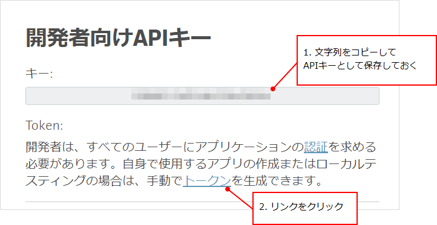
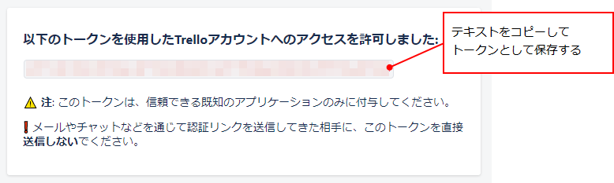

## はじめに
PowerShellで、Trelloのカード作成などを自動化したい。

* Windows 10
* PowerShell v5.1

## APIキーとトークンを取得する
参考：[API Introduction](https://developer.atlassian.com/cloud/trello/guides/rest-api/api-introduction/)

[https://trello.com/app-key](https://trello.com/app-key) へアクセス。

画面に表示されるAPIキーをコピーして保存しておく。
そのあと、自分でテストするためのAPIトークンを取得する。APIキーの下に記載されている「トークン」のリンクをクリックする。



このアプリを許可するかどうか確認する画面が表示されるので、下へスクロールして「許可」を押す。

「以下のトークンを使用したTrelloアカウントへのアクセスを許可しました」の画面になる。
トークンをコピーして保存する。



この手順で取得するトークンはあくまでも自分用なので、APIキーを使ったスクリプトを共有する際は、トークンはユーザーに取得してもらうことになる。

## 自分が所属するボードの一覧を取得

```powershell
$params = @{
    key = "APIキー"
    token = "トークン"
}
$uri = "https://api.trello.com/1/members/me/boards"
$response = Invoke-WebRequest -Uri $uri -Body $params
$content = $response.Content
$boards = ConvertFrom-Json $content

foreach ($item in $boards) {
    Write-Host $item.id
    Write-Host $item.name
    Write-Host $item.url
    Write-Host ""
}
```

自分が所属するボードの一覧を取得できる。ここで取得できるボードIDを、カード作成などのAPIで使用するので、まずこのAPIを実行してボードIDのリストを取得しておくと良い。

## ボードのリスト一覧を取得

```powershell
$params = @{
    key = "APIキー"
    token = "トークン"
}
$boardId = "ボードID"

$uri = "https://api.trello.com/1/boards/${boardId}/lists"
$response = Invoke-WebRequest -Uri $uri -Body $params
$content = $response.Content
$lists = ConvertFrom-Json $content

foreach ($item in $lists) {
    Write-Host $item.id
    Write-Host $item.name
    Write-Host ""
}
```

特定のボードのリスト (カードをまとめるグループのようなもの) の一覧を取得できる。
APIでカード作成などを行う場合、どのリストに作成するかは必須指定なので、このAPIをあらかじめ実行してリストIDを取得しておくと良い。

## カードを作成

```powershell
$params = @{
    key = "APIキー"
    token = "トークン"
    idList = "リストID"
    idCardSource = "テンプレートカードID"
    name = "カードの名前"
}

$uri = "https://api.trello.com/1/cards"
$response = Invoke-WebRequest -Uri $uri -Body $params -Method "POST"
```

既存のカードを元ネタにして、新しいカードを作成する。
`idCardSource` を指定しなければ、元ネタ無しで新しいカードを作成する。

## 認証
参考：[Authorization](https://developer.atlassian.com/cloud/trello/guides/rest-api/authorization/)

APIがユーザーの認証を得る方法は2つある。
1つは `1/authorize` 経由、もう1つはOAuthを使う方法があるが、今回は `1/authorize` を利用してトークンを得ることにする。

処理の流れとしては、大まかに下記の通り：

1. スクリプトはブラウザで `https://api.trello.com/1/authorize` を開く。
1. スクリプトはトークンの入力を待つ。
1. ユーザーはアプリを許可する。
1. 許可するとブラウザにトークンが表示されるので、ユーザーはそれをコピペしてスクリプトへ入力する。
1. スクリプトは受け取ったトークンをファイルに保存する。

サンプルは下記の通り。

```powershell
function Get-Token() {
    # トークンを得る

    $queryString = "?"
    $queryString = ($queryString + "key=" + $API_KEY) # APIキーに置き換える
    $queryString = ($queryString + "&scope=read,write")
    $queryString = ($queryString + "&expiration=never")
    $queryString = ($queryString + "&name=TestApp")
    $queryString = ($queryString + "&response_type=token")

    $uri = ("https://api.trello.com/1/authorize" + $queryString)

    Start-Process $uri

    $token = Read-Host "ブラウザに表示されたトークンを入力してください"

    # トークンをファイルに書き込み
    $dirPath = $env:LOCALAPPDATA + "\TestApp"
    if (-not (Test-Path $dirPath)) {
        New-Item $dirPath -ItemType "directory"
    }

    $filePath = $dirPath + "\token.txt"
    if (Test-Path $filePath) {
        Remove-Item $filePath
    }
    
    Out-File -FilePath $filePath -InputObject $token
}
```


