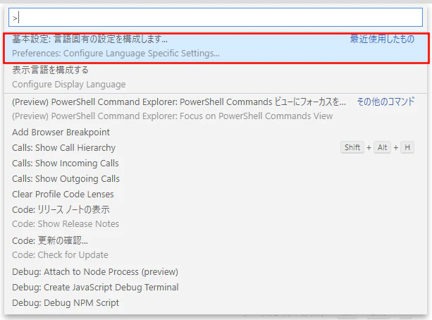
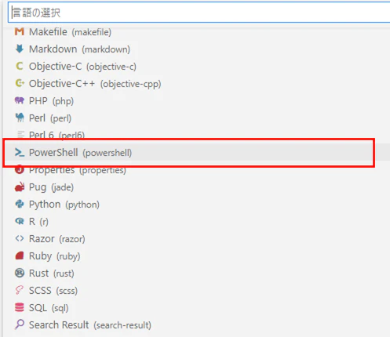
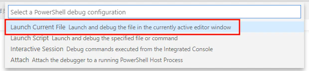
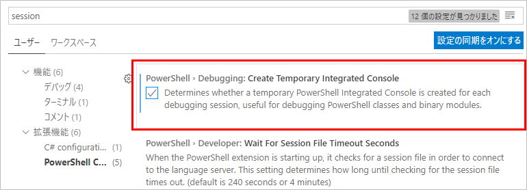

## 拡張機能の追加
1. VSCodeでps1ファイルを開く。
2. PowerShellの拡張機能をインストールするか聞かれるので、インストールする。

## 文字コードの設定を変更
PowerShell ISE の既定の文字コードは UTF-8 bom付 だが、VSCodeは UTF-8。この違いが原因で日本語を出力した際などに文字化けするため、設定を変更する。

`F1` または `Ctrl` + `Shift` + `P` を押してコマンドパレットを表示する。

`Configure Language Specific Settings` と入力、出てきたものをクリック。  

`PowerShell` を選ぶ。  

Settings.jsonが開くので、`"files.encoding": "utf8bom"` を追記する。

Settings.jsonを保存して閉じる。

## デバッグの設定

### 開いているスクリプトを起動するようにする
エディタウィンドウで開いているファイルをデバッグするように設定する手順。

「実行」のタブを開く(`Ctrl` + `Shift` + `D`)。

「launch.jsonファイルを作成します」のリンクを押す。

「Launch Current File」を選ぶ。

launch.jsonが作成されて表示されるので、閉じる。

これで、デバッグしたいps1ファイルを開いた状態でF5を押すと、そのファイルが実行されるようになる。

### デバッグ時は一時的なセッションを使う
VSCode でスクリプトをデバッグするときは、ターミナルに表示されている「PowerShell Integrated Console」で実行される。
このままだとずっと同じセッションが再利用されるので、例えば psm1 ファイルを編集してデバッグしても、変更後の内容が反映されなかったりする。
これを防ぐために、拡張機能の設定を変更し、デバッグ実行の度に一時的なセッションを開くようにする。

手順は下記の通り：

1. Ctrl + , で設定を開く。

2. 検索欄に「session」と入力し、カテゴリ 拡張機能 → PowerShell Configuration の中にある「PowerShell > Debugging: Create Temporary Integrated Console」のチェックボックスをオンにする。

