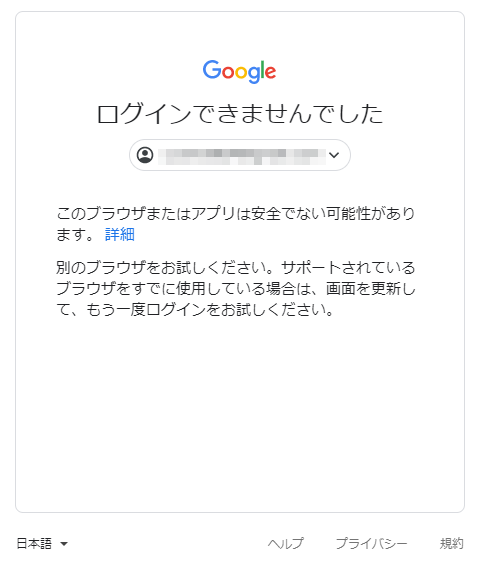
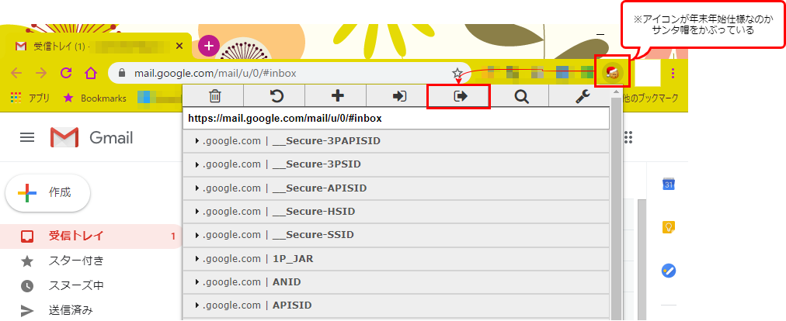

## Puppeteerとは
Chrome または Chromium を操れるライブラリ。スクレイピングや自動テストに使える。Node.jsから使用できる。

公式サイト
https://pptr.dev/

初稿を書いたときのバージョン：1.19.0

## インストール
任意のプロジェクトフォルダで下記コマンドを実行。

```
npm i puppeteer
```

既定では、puppeteerをインストールすると、最新バージョンのChromiumも一緒にダウンロードされる。ダウンロードさせたくない場合は、環境変数で設定を変更するか、`puppeteer-core`の使用を検討すると良い。

### puppeteer-coreを使う
v1.7.0から追加されたパッケージ。Chromiumのダウンロードを行わない。代わりに既にPCにあるChrome/Chromiumなどを使用する。
大体の場合は`puppeteer`の方を使えば良いが、スクリプトを動かす環境内にChomeがあり、そちらを使えば良いやと思う場合などは、`puppeteer-core`を使う方が容量を取らなくて良さそう。

## ブラウザの起動と終了

```javascript
// headless : ブラウザを画面に表示するかどうかのフラグ。既定値はtrueで非表示となる。
// executablePath : 同梱されているChromiumを使用しない場合のみ、インストール済みのChromeやChromiumのパスを指定する。puppeteer-core使用時は必須指定。
const LAUNCH_OPTION = {
	 headless : false
	,executablePath : 'C:/Program Files/Google/Chrome/Application/chrome.exe'
};

const browser = await puppeteer.launch(LAUNCH_OPTION);
try {
	const page = await browser.newPage();	// 新しいタブを開く
	
	// ここにスクレイピングを実装

} finally {
	await browser.close();
}
```

## 指定したURLへ移動
ブラウザを起動したら、まずはスクレイピングしたいWebサイトへ移動することが多いと思う。

```javascript
// 定義
await page.goto(url[, options]);

// サンプル
await page.goto("https://www.yahoo.co.jp/", {"waitUntil":"domcontentloaded"});
```
パラメータ：

* `url` \<string> 移動先のURL。
* `options` \<Object> オプション。
 * `timeout` \<number> 待機時間の最大値(ミリ秒)。既定値は30秒。0を指定するとタイムアウト無しになる。既定値は `page.setDefaultNavigationTimeout(timeout)` または `page.setDefaultTimeout(timeout)` で変更できる。
 * `waitUntil` どの時点をもって移動完了とみなすかの設定値。既定値は `load`。配列にして複数の文字列を渡した場合は、すべてのイベントが完了してから移動完了とみなす。
     * `load` - ページの読込みが、画像などを含めて完了。
     * `domcontentloaded` - HTMLの読込みが終わった。
     * `networkidle0` - ネットワーク接続が0件の状態が500ミリ秒続いたとき。
     * `networkidle2` - ネットワーク接続が2件以下の状態が500ミリ秒続いたとき。
 * `referer` \<string> リファラのヘッダー値。

## 要素を取得する
Webページを表示できたら、操作したいテキストボックスやボタンを指定するが、その各要素はCSSセレクタまたはXPathで指定できる。

```javascript
// CSSセレクタによる要素の取得(最初の1件のみ)
const element1 = await page.$("#main-container");

// CSSセレクタによる要素の取得(一致するものすべて)
const elements1 = await page.$$(".section");

// XPathによる要素の取得(一致するものすべて)
const elements2 = await page.$x("/html/body/h1");
```

`page.$()`を使用しなくとも、クリックや文字入力は専用メソッドがあるが、CSSセレクタによる要素指定が基本となっている。XPathで要素を指定したい場合は、`page.$x()`を使う必要がある。

```javascript
// CSSセレクタを使ってクリック
await page.click("#confirm-button");

// XPathを使ってクリック
const elements = await page.$x("/html/body/input[@type='button']");
if (elements.length > 0) {
    await elements[0].click();
}
```

XPath を使う場合、パスの指定方法に注意。例えば下記のように、先に特定の div 要素を取得し、その中にある a タグを XPath で見つけたい場合は、XPath は `.//a` と書く。

```javascript
let div = await page.$("div#container");

let link1 = await div.$x("//a");    // NG
let link2 = await div.$x(".//a");   // OK
```

こういう場合に `//a` と書いてしまうと、div 配下の要素を探すように記述したつもりでも、それを無視してページ全体から a タグを探してしまう。

### 要素が存在するか調べる
要素が見つからない場合、`page.$()`の戻り値がnullになるので、それで存在チェックができる。

### 指定したテキストを含む要素を取得する
XPath を使うと便利。

```javascript
// ページ全体から「あああ」というテキストを持つdivタグを探す
const elements1 = await page.$x('//div[contains(text(), "あああ")]');

// 指定のタグの中から「いいい」というテキストを持つaタグを探す
// ※XPathの先頭に「.」が必要。無いとページ全体を探索する。
const parent = await page.$("div#container");
const elements2 = await parent.$x('.//a[contains(text(), "いいい")]');
```

## クリックする

```javascript
// 定義
await page.click(selector[, options]);
// サンプル
await page.click("#submit-button");
```

パラメータ：

* `selector` \<string> 対象となる要素のセレクタ
* `options` \<Object>
 * `button` \<"left"|"right"|"middle"> 既定値：`left`
 * `clickCount` \<number> 既定値：`1`
 * `delay` \<number> `mousedown`と`mouseup`の間隔をミリ秒で指定する。既定値：`0`

クリックでナビゲーションが発生する場合、`page.waitForNavigation()` を使ってナビゲーションが終わるまで待機する必要がある。

### クリック後のページ移動を待つ
クリックなどでナビゲーションが発生する場合、クリックした後ナビゲーションが終わるのを待つ必要がある。

```javascript
const [response] = await Promise.all([
  page.waitForNavigation(waitOptions),
  page.click(selector, clickOptions),
]);
```

ページ移動を伴うナビゲーションであれば `waitUntil` に `load` や `domcontentloaded` などを指定すればよいが、非同期のナビゲーションであれば、`networkidle0` などを指定する。

```javascript
// 定義
await page.waitForNavigation([option]);
```

* `options` \<Object>
  * `timeout` \<number> 最大待機時間をミリ秒で指定する。0を指定するとタイムアウトなしになる。既定値：30秒。既定値は`page.setDefaultNavigationTimeout(timeout)`または`page.setDefaultTimeout(timeout)`で変更可能。
  * `waitUntil` \<string|Array\<string>> どれくらい待つか指定する。既定値：`load`。複数指定した場合は、指定したすべてのイベントが終わるまで待つ。指定できる値は`page.goto()`と同じ。
* 戻り値: \<Promise\<?Response>>

waitForNavigation を使っても読み込み完了の検知がうまくいかない場合は、「ページの描画が終わるのを待つ」の章を参照。

### Ctrlキーを押しながらリンクをクリックする
単純にリンクを新しいタブで開きたいなら、`browser.newPage()`してから指定のURLへ移動するのが最もシンプルだと思うが、Ctrlキーを押しながら`click()`を実行することでも、リンクを新しいタブで開くことができる。ただしこの場合、新しいタブに自動的にフォーカスが移らないので注意。

```javascript
// Ctrlキーを押す(ControlRightでもOK)
await page.keyboard.down("ControlLeft");
// リンクを押す
await page.click("a");
// Ctrlキーを話す
await page.keyboard.up("ControlLeft");

// 開いたタブを最前面にする
const pages = await browser.pages();
const newPage = pages[pages.length-1];
await newPage.bringToFront();
```

## 文字を入力する
`page.type(selector, text[, options])`

* `selector` \<string> 対象となる要素のセレクタ
* `text` \<string> 入力する文字列
* `options` \<Object>
 * `delay` \<number> キー入力間の待機時間をミリ秒で指定する。既定値：0。


## テキストを取得する

```javascript
const ele = await page.$(".scrape");
const text = await page.evaluate(elm => elm.textContent, ele);
```

`Page`オブジェクトにテキスト取得のメソッドはないため、`evaluate`メソッドを代わりに使用する。
`evaluate`メソッドは、引数で指定した関数をページ内で実行する。第1引数に実行する関数、第2引数に関数へ渡す引数を指定する。この引数に、`page.$()`などで取得した`ElementHandle`を渡すことが可能。

## 指定秒を待つ
`page.waitForTimeout(milliseconds)`

引数にミリ秒を指定する。

## 要素が表示されるまで待つ
`page.waitForSelector(selector, {visible:true});`

## ページの描画が終わるのを待つ
参考：[javascript - Puppeteer wait until page is completely loaded - Stack Overflow](https://stackoverflow.com/questions/52497252/puppeteer-wait-until-page-is-completely-loaded)

新しいWebページを開いた後、ページが読み込まれるのを待つには `page.waitForNavigation()` などを使えばよいが、
非同期でいろいろ読み込まれたり、読み込まれた後もスクリプトが動作していてページの描画が終わっていない場合がある。
これを解決するために、Webページの内容が一定時間変化しないのを待つ、という方法もある。
下記サンプルでは、WebページのHTMLの文字数をもとに、HTMLの書き換えが一定時間収まるのを待つ。

```js
async function waitTillHTMLRendered(page, timeout = 30000) {
	const checkDurationMsecs = 1000;  // チェックする間隔(ミリ秒)
	const minStableSizeIterations = 3;  // ○回チェックしてサイズに変化がなければOKとする
	const maxChecks = timeout / checkDurationMsecs;
	let lastHTMLSize = 0;
	let checkCounts = 1;
	let countStableSizeIterations = 0;
  
	while(checkCounts++ <= maxChecks){
		let html = await page.content();
		let currentHTMLSize = html.length; 

		let bodyHTMLSize = await page.evaluate(() => document.body.innerHTML.length);

		if (lastHTMLSize == currentHTMLSize) {
			console.log('last: ', lastHTMLSize, ' == curr: ', currentHTMLSize, " body html size: ", bodyHTMLSize);
		} else {
			console.log('last: ', lastHTMLSize, ' <> curr: ', currentHTMLSize, " body html size: ", bodyHTMLSize);
		}

		if(lastHTMLSize != 0 && currentHTMLSize == lastHTMLSize) {
			countStableSizeIterations++;
		} else {
			countStableSizeIterations = 0; //reset the counter
		}

		if(countStableSizeIterations >= minStableSizeIterations) {
			console.log("Page rendered fully..");
			break;
		}

		  lastHTMLSize = currentHTMLSize;
		  await page.waitForTimeout(checkDurationMsecs);
	}
}
```

## Chromeで動的に生成される要素を調べる
一時停止(F8)を押すか、要素で右クリック→「検証」を選ぶ。

[javascript - マウスカーソルを乗せている間だけ表示される要素を、開発者ツールで調べるには - スタック・オーバーフロー](https://ja.stackoverflow.com/questions/24648/%E3%83%9E%E3%82%A6%E3%82%B9%E3%82%AB%E3%83%BC%E3%82%BD%E3%83%AB%E3%82%92%E4%B9%97%E3%81%9B%E3%81%A6%E3%81%84%E3%82%8B%E9%96%93%E3%81%A0%E3%81%91%E8%A1%A8%E7%A4%BA%E3%81%95%E3%82%8C%E3%82%8B%E8%A6%81%E7%B4%A0%E3%82%92-%E9%96%8B%E7%99%BA%E8%80%85%E3%83%84%E3%83%BC%E3%83%AB%E3%81%A7%E8%AA%BF%E3%81%B9%E3%82%8B%E3%81%AB%E3%81%AF)

## ダイアログに対応する
Webサイトが表示するダイアログに対して処理が必要な場合のサンプル。

```javascript
// ダイアログが表示されたらOKを押す
page.on("dialog", async (dialog)=>{
    console.log("dialog message : " + dialog.message());
    await dialog.accept();
});
```

一度だけ処理させたいなら、`page.once()`を使う方が良いかもしれない。使用方法は`page.on()`と同じ。

[Dialogクラスの説明](https://pptr.dev/#?product=Puppeteer&version=v2.1.1&show=api-class-dialog)

## ログインが必要なページへのアクセス
以下の方法がある：

* IDとパスワードを入力してログインする動作をスクリプトに実装する。
    * 良いところ：単純で分かりやすい。
    * 悪いところ：Googleには弾かれる。
* ChromeからCookieをエクスポートし、それをpuppeteerに読み込ませて使用する。
    * 良いところ：Googleにもログインできる。
    * 悪いところ：Cookieをエクスポートするのが手間。Cookieの有効期限も考慮しなければならない。

アカウント＋パスワードでGoogleにログインするスクリプトを作成し実行したところ、ページが以下のようになってログインできなかった。


puppeteerの操作を自動テストツールと判定して、ログインを阻止していると思われる。こういう場合、Cookieを使う方法だとログインせずともページがログイン後の状態となって上手く動作する場合がある。

### Cookieを使用してログインする
Webサイトへログインした後のCookieを保存しておき、それをpuppeteerに読み込ませることで、自動化中もログイン後と同じ状態にする。

#### EditThisCookieのインストール
Chromeから簡単にCookieをエクスポートするためのツールをインストールする。EditThisCookieはChrome拡張機能として提供されている。

#### Cookieのエクスポート
Chromeで目的のWebサイトへログインした後、EditThisCookieのアイコンをクリックして、エクスポートのアイコンをクリックする。



Cookieの内容がJSON形式でクリップボードへエクスポートされるので、テキストファイルへ貼り付けて保存する。

#### puppeteerでCookieを読み込む
保存したCookieのファイルを、puppeteerで読み込む。目的のサイトへ移動する前にCookieを読み込んでおくこと。また、サンプルには実装していないが、Cookieの有効期限が切れた場合も考慮しておく必要がある。

```javascript
const puppeteer = require("puppeteer-core");
const config = require("config");
const fs = require("fs");

async function useCookieSample(page) {

	let content = fs.readFileSync("cookie.json");
	let cookie = JSON.parse(content);

	await page.setCookie(...cookie);

	await page.goto("https://gmailのURL", {
		"waitUntil" : "domcontentloaded"
	});
}
```

参考：[javascript - login into gmail fails for unknown reason - Stack Overflow](https://stackoverflow.com/a/56629942)

## navigator.webdriver をオフにする

Webサイトによっては、puppeteerでアクセスするとツールであることを判定して、通常とは異なるページを返す。Webサイト側がチェックをかけているのだが、その方法の一つとして、JavaScriptを使って簡単に判定できる。
`navigator.webdriver` というプロパティで、puppeteer で Chrome を動かしているときもこの値が `true` になっている。

参考：[Navigator.webdriver - Web API | MDN](https://developer.mozilla.org/ja/docs/Web/API/Navigator/webdriver)

puppeteer側でこのプロパティをなくすことが可能。

```javascript
const page = await browser.newPage();
await page.evaluateOnNewDocument(() => {
	Object.defineProperty(navigator, 'webdriver', ()=>{});
	delete navigator.__proto__.webdriver;
});
await page.goto("https://www.yahoo.co.jp/");
```

ただ、自分で試行錯誤するより、有志のライブラリの力を借りる方が便利だと思う。

[berstend/puppeteer-extra](https://github.com/berstend/puppeteer-extra/tree/master/packages/puppeteer-extra-plugin-stealth)
