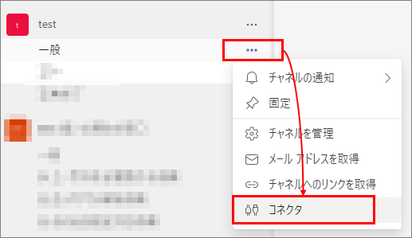
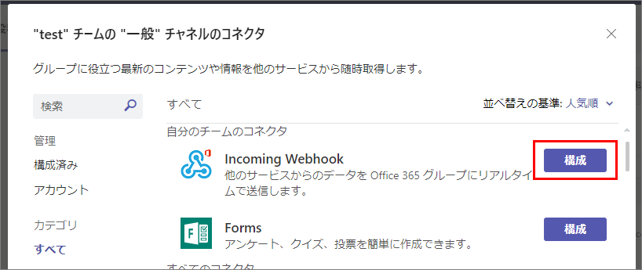
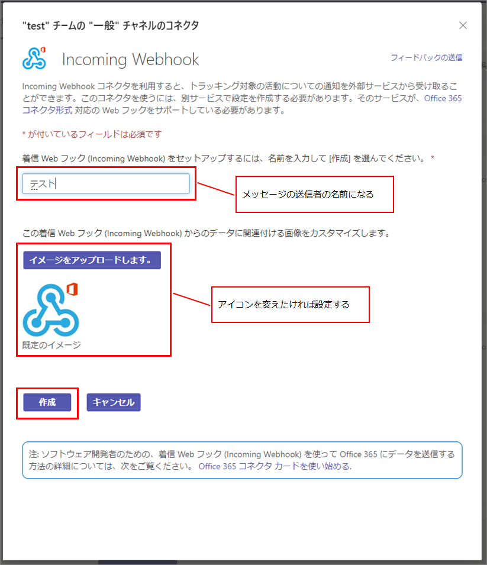
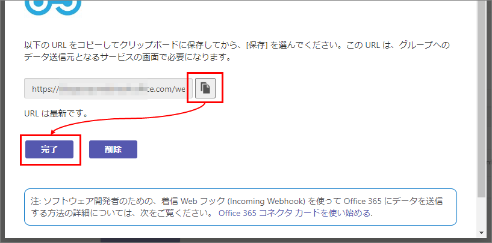
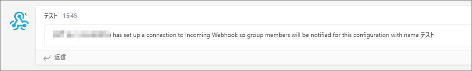
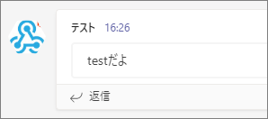

## はじめに
Teams の特定のチャネルへメッセージを送る方法の一つ、Incoming Webhook の使い方を記載する。

## Incoming Webhook の追加
メッセージ送信先のチャネルのコネクタを追加する。



コネクタの一覧から Incoming Webhook を探し、「構成」をクリック。



送信者の名前とアイコンを設定し、「作成」をクリック。



少し待つとURLが表示されるので、コピーして保存しておく。その後、完了をクリックして画面を閉じる。



チャネルに、設定が完了したというメッセージが投稿される。



## メッセージを作る
現時点では、Incoming Webhook 経由でカードを送る場合、[旧来のメッセージカード形式](https://docs.microsoft.com/en-us/outlook/actionable-messages/message-card-reference) のみサポートされている。
Adaptive Card はサポート外。Adaptive Card を使いたい場合は、Power Automate 経由で送るなど別の手段を使う。


### メッセージを送る
PowerShell でメッセージを送るサンプルを下記に記載する。

```powershell
$url = "https://xxxxx"  # Incoming Webhook の URL
$body = "{`"text`":`"testだよ`"}"
#$body = Get-Content -Path "C:\test\card.txt"    # テキストファイルにjsonを書いてテストする場合はこっち

$bodyByte = [Text.Encoding]::UTF8.GetBytes($body)

$ret = Invoke-WebRequest -Body $bodyByte -Method Post -Uri $url
```

↓Teamsで受信した様子

