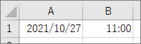

## Excel のセルから日付と時刻の取得



日付の値はDate型で取得できる。時刻のみの値はDouble型で取得できる。

```vb
Public Sub Test()
    Dim val1
    Dim val2
    
    val1 = Sheet1.Range("A1").Value
    Debug.Print val1
    Debug.Print TypeName(val1)
    
    val2 = Sheet1.Range("B1").Value
    Debug.Print val2
    Debug.Print TypeName(val2)
End Sub
```

↓　実行結果

    2021/10/27 
    Date
    0.458333333333333 
    Double

Date 型であっても日付のシリアル値と同じように扱えるので、val1 + val2 をすると、2021/10/27 11:00 になる。

```vb
Public Sub Test()
    Dim val1
    Dim val2
    
    val1 = Sheet1.Range("A1").Value
    val2 = Sheet1.Range("B1").Value
    
    Debug.Print (val1 + val2)
End Sub
```

↓ 実行結果

    2021/10/27 11:00:00 

## 時刻をシリアル値で扱うときの注意

日付シリアル値の小数部だけ取り出せば、異なる日付の時刻だけを比較できたりしそうだが、日付シリアル値は浮動小数点数で桁落ちなどが容易に発生するので実際はあんまり使えない。

下記サンプルは、異なる日付の11:00のシリアル値をチェックしたもの。

```vb
Public Sub Test()
    Dim val1 As Date
    Dim val2 As Date
    
    val1 = #10/27/2021 11:00:00 AM#
    val2 = #1/2/1900 11:00:00 AM#
    
    Debug.Print CDbl(val1)
    Debug.Print CDbl(val2)
End Sub
```

↓ 実行結果

    44496.4583333333 
    3.45833333333333 

小数点以下の桁数が違うことが分かる。
両者の小数部を取り出して比較しても、同じとはならない。
時刻を取り出すときは、おとなしく `Format(dt, "hhmm")` などを使って比較したほうがいい。