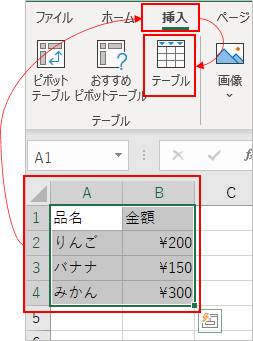
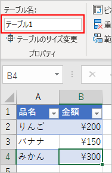

## はじめに
シートに作った表に対して、「挿入」タブ → 「テーブル」を選ぶと テーブル というひとかたまりになる。
こうすると VBA でも ListObject として扱えるようになり、一覧データの操作が楽になる。



## リストの名前
リスト内のセルを選択すると、画面上部のリボンの部分が「テーブルデザイン」というタブになる。
自動的にタブが変わらない場合は、「テーブルデザイン」タブを自分でクリックする必要がある。



「テーブル名」の欄で任意の名前を指定できる。この名前を設定しておくと、VBA から参照するときに便利。

## ListObject を取得する
Worksheet オブジェクトの [ListObjects](https://docs.microsoft.com/en-us/office/vba/api/excel.worksheet.listobjects) プロパティを使う。

```vb
Public Sub Sample1()

    Dim oList As ListObject
    
    Set oList = Sheet1.ListObjects("テーブル1")
    
End Sub
```

## ListObject のプロパティ

### ListRows
テーブルのヘッダー行、集計行を除いた部分を取得する。
ListRows はコレクションになっており、各要素は ListRow オブジェクトである。

### DataBodyRange
テーブルのヘッダー行と集計行を除いた部分の Range オブジェクトを取得する。

## フィルタの設定
フィルタを設定する前に、すでに設定されているフィルタを解除しておくのが大事。
フィルタを解除するには、列番号のみを指定して AutoFilter メソッドを実行する。

```vb
Public Sub Sample1()

    Dim oList As ListObject
    
    Set oList = Sheet1.ListObjects("テーブル1")
    
    ' フィルタのクリア
    ClearAutoFilter oList.Range
    
    ' フィルタを設定
    oList.Range.AutoFilter 1, "みかん"
    
End Sub

Private Sub ClearAutoFilter(ByRef oRange As Range)
    Dim idx As Integer
    
    For idx = 1 To oRange.Columns.Count
        oRange.AutoFilter idx
    Next

End Sub
```

### フィルタ後の結果を取得
ListObject の Range に対して`SpecialCells(xlCellTypeVisible)` を指定して、表示されているセルを取得する。注意点としては、ListObject.Range にはタイトル行が含まれるため、フィルタに一致する結果がない場合でも、Rows.Count は 1 になるし、データ部を取得したいなら2行目以降から取得する必要がある。

わざわざタイトル行の含まれる ListObject.Range を使う理由は、フィルタに一致する結果が0件の場合、SpecialCells メソッドがエラーを発生させるためである。

```vb
Public Sub Sample1()

    Dim oList As ListObject
    Dim oRange As Range
    Dim idx As Integer
    
    
    Set oList = Sheet1.ListObjects("テーブル1")
    
    ' フィルタのクリア
    ClearAutoFilter oList.Range
    
    ' フィルタを設定
    oList.Range.AutoFilter 1, "みかん"
    
    ' フィルタに一致した行を取得
    ' (1行目にタイトル行を含む)
    Set oRange = oList.Range.SpecialCells(xlCellTypeVisible)
    
    For idx = 2 To oRange.Rows.Count  ' 1行目はタイトル行なので idx は2から始める
        
    Next
    
End Sub

Private Sub ClearAutoFilter(ByRef oRange As Range)
    Dim idx As Integer
    
    For idx = 1 To oRange.Columns.Count
        oRange.AutoFilter idx
    Next

End Sub
```
