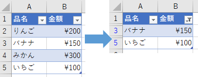

## はじめに
シートに作った表に対して、「挿入」タブ → 「テーブル」を選ぶと テーブル というひとかたまりになる。
こうすると VBA でも ListObject として扱えるようになり、一覧データの操作が楽になる。


## リストの名前
リスト内のセルを選択すると、画面上部のリボンの部分が「テーブルデザイン」というタブになる。
自動的にタブが変わらない場合は、「テーブルデザイン」タブを自分でクリックする必要がある。


「テーブル名」の欄で任意の名前を指定できる。この名前を設定しておくと、VBA から参照するときに便利。

## ListObject を取得する
Worksheet オブジェクトの [ListObjects](https://docs.microsoft.com/en-us/office/vba/api/excel.worksheet.listobjects) プロパティを使う。

```vb
Public Sub Sample1()

    Dim oList As ListObject
    
    Set oList = Sheet1.ListObjects("テーブル1")
    
End Sub
```

## ListObject のプロパティ

### ListRows
テーブルのヘッダー行、集計行を除いた部分を取得する。
ListRows はコレクションになっており、各要素は ListRow オブジェクトである。

### DataBodyRange
テーブルのヘッダー行と集計行を除いた部分の Range オブジェクトを取得する。

## 行の追加

[ListRows.Add](https://docs.microsoft.com/en-us/office/vba/api/excel.listrows.add) メソッドを使う。
引数なしで実行すると、テーブルの末尾に新しい行が追加される。

```vb
Public Sub Sample1()

    Dim oList As ListObject
    Dim oRow As ListRow
    
    Set oList = Sheet1.ListObjects("テーブル1")
    Set oRow = oList.ListRows.Add()
    
    oRow.Range(1, 1) = "値1"
    oRow.Range(1, 2) = "値2"
    oRow.Range(1, 3) = "値3"
    
End Sub
```

## フィルタの設定
フィルタを設定する前に、すでに設定されているフィルタを解除しておくのが大事。
フィルタを解除するには、列番号のみを指定して AutoFilter メソッドを実行する。

```vb
Public Sub Sample1()

    Dim oList As ListObject
    
    Set oList = Sheet1.ListObjects("テーブル1")
    
    ' フィルタのクリア
    ClearAutoFilter oList.Range
    
    ' フィルタを設定
    oList.Range.AutoFilter 1, "みかん"
    
End Sub

Private Sub ClearAutoFilter(ByRef oRange As Range)
    Dim idx As Integer
    
    For idx = 1 To oRange.Columns.Count
        oRange.AutoFilter idx
    Next

End Sub
```

### フィルタ後の結果を取得
ListObject の Range に対して`SpecialCells(xlCellTypeVisible)` を指定して、表示されているセルを取得する。


注意点は下記の通り：

* ListObject.Range にはタイトル行が含まれるため、[Application.Intersect](https://docs.microsoft.com/en-us/office/vba/api/excel.application.intersect) で ListObject.DataBodyRange と重なっている部分を取得する。
  * DataBodyRange に対して SpecialCells(xlCellTypeVisible) を実行すると、可視セルが 0 の場合にエラーになる。
* 可視セルが複数のエリアに渡る場合がある (例：A1:B2,D1:E2 など)。そのため、Range.Areas もチェックする必要がある。

↓可視セルが複数エリアになった例 (3行目と5行目が可視セル)  


```vb
Public Sub Sample1()

    Dim oList As ListObject
    Dim oRange As Range
    Dim aidx As Integer
    Dim ridx As Integer
    Dim rcount As Integer
    
    
    Set oList = Sheet1.ListObjects("テーブル1")
    
    ' フィルタのクリア
    ClearAutoFilter oList.Range
    
    ' フィルタを設定
    oList.Range.AutoFilter 2, "<200"
    
    ' フィルタに一致した行を取得
    ' (1行目にタイトル行を含む)
    Set oRange = oList.Range.SpecialCells(xlCellTypeVisible)
    ' データ行と重なっている部分のみ取り出す
    Set oRange = Application.Intersect(oRange, oList.DataBodyRange)
    
    If oRange Is Nothing Then
        Debug.Print "フィルタに一致した行はありません"
        Exit Sub
    End If
    
    ' 一致した行数を取得したい場合は、Areas ごとの行数を数える
    rcount = 0
    For aidx = 1 To oRange.Areas.Count
        rcount = rcount + oRange.Areas(aidx).Rows.Count
    Next
    
    Debug.Print (rcount & "行が一致しました")

    ' サンプル：一致した行の1列目の値を取得
    For aidx = 1 To oRange.Areas.Count
        For ridx = 1 To oRange.Areas(aidx).Rows.Count
            Debug.Print oRange.Areas(aidx)(ridx, 1).Value
        Next
    Next
    
End Sub

Private Sub ClearAutoFilter(ByRef oRange As Range)
    Dim idx As Integer
    
    For idx = 1 To oRange.Columns.Count
        oRange.AutoFilter idx
    Next

End Sub
```
