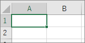
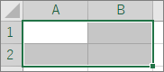
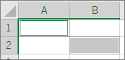
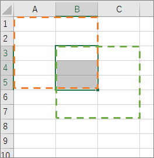
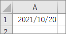
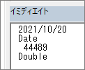

## 概要
Excel VBA でセルの値を取得・編集する際は、[Worksheet.Range](https://docs.microsoft.com/en-us/office/vba/api/excel.worksheet.range) を使う。ほかにも同じようなことができるプロパティとして、 [Worksheet.Cells](https://docs.microsoft.com/en-us/office/vba/api/excel.worksheet.cells) や [Application.Range](https://docs.microsoft.com/en-us/office/vba/api/excel.application.range) がある。それぞれのプロパティの特徴と個人的な好みは下記の通り。

* Worksheet.Range
  * 個人的には一番おすすめのやりかた。ワークシートを指定してからセルを指定するため、的確な操作ができる。
* Worksheet.Cells
  * 単一セルしか取得できない。明確に1つだけのセルを指定するなら有用。
* Application.Range
  * `Range("A1")` と書いた場合、そのときアクティブなシートのA1セルが取得される。どのシートがアクティブであっても良いならいいが、大体はそうではないのでこの書き方は避けた方がいい。

## 基本的なセル指定

* `Sheet1.Range("A1")` ： A1セルを取得する。<br>
* `Sheet1.Range("A1:B2")` ： A1～B2の範囲を取得する。<br>
* `Sheet1.Range("A1,B2")` ： A1 と B2 それぞれを取得する。<br>

A1:B2 と同じ結果になる書き方：

* `Range(Sheet1.Range("A1"), Sheet1.Range("B2"))`
* `Sheet1.Range("A1", "B2")`

A1,B2 と同じ結果になる書き方：

* `Application.Union(Sheet1.Range("A1"), Sheet1.Range("B2"))` ： [Application.Union](https://docs.microsoft.com/en-us/office/vba/api/excel.application.union)

他の色々な書き方：

* `Range("Sheet1!A1")` ： Application.Range を使う場合でも、アドレスにシート名を含めれば明確にシートを指定できる。
* `Application.Intersect(Sheet1.Range("A1:B5"), Sheet1.Range("B3:C7"))` ： 2つの範囲が重なった部分を取得できる。[Application.Intersect](https://docs.microsoft.com/en-us/office/vba/api/excel.application.intersect) <br>


## 日付のセル値



日付が書かれたセルの場合、Range.Value で Date 型の値を取得できる。シリアル値で取得したい場合は、[Range.Value2](https://docs.microsoft.com/en-us/office/vba/api/excel.range.value2) プロパティを使う。

```vb
Public Sub Test()
    Dim val1
    Dim val2
    
    val1 = Sheet1.Range("A1").Value
    Debug.Print val1
    Debug.Print TypeName(val1)
    
    val2 = Sheet1.Range("A1").Value2
    Debug.Print val2
    Debug.Print TypeName(val2)
End Sub
```

↓実行結果  


Value2 プロパティは値の型に Date と Currency を使わない。したがって、日付のセルと通貨のセルの値はそれぞれ数値で取得できる。
