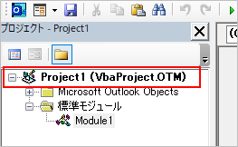
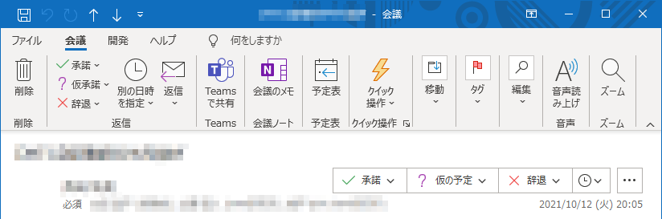

## はじめに
Outlook VBA の始め方を記載する。
PC にインストール済みの Outlook に付随している Visual Basic for Applications を使ったマクロ開発を目指す。

Office のバージョンは 365 。

## 開発タブを表示する
既定では Outlook のリボンに「開発」タブが表示されていないので、設定を変更する。

1. ファイル → オプション → リボンのユーザー設定 をクリック。
1. 右側のリストにある「開発」にチェックを入れ、OKボタンをクリック。
1. リボンに「開発」タブが表示される。

## マクロの実行を許可する
既定では自作のマクロが実行されないので、設定を変更する。

1. 「開発」タブ → マクロのセキュリティ をクリック。
1. 「マクロの設定」欄にある選択肢で、下記のいずれかを選択してOKボタンをクリック。
    * すべてのマクロに対して警告を表示する
    * すべてのマクロを有効にする
1. Outlook を再起動する

「すべてのマクロに対して警告を表示する」にすると、マクロを実行するたびに警告が表示され、実行するかどうか選ぶ必要がある。それが煩わしいのであれば、リスクを検討したうえで「すべてのマクロを有効にする」を選ぶと良いと思われる。

## エディタを開く
1. 「開発」タブ → Visual Basic をクリック。
1. セキュリティの警告が表示されたら、「マクロを有効にする」をクリック。
1. Visual Basic for Applications が起動する。

## プロジェクトとは
エディタの左側を見ると、オブジェクトやモジュールは「Project1」の中に作られるように見える。



この「プロジェクト」は既定で作成され、1ユーザーごとに1つだけ使える。同時に複数プロジェクトを作ったり実行したりはできない。「VbaProject.OTM」はユーザーフォルダに保存されている (Windows 10 の PC で調べてみたところ、`%APPDATA%\Microsoft\Outlook` に保存されていた) 。

別のプロジェクトファイルを実行したい場合は、下記の手順が必要。

1. Outlook を終了させる。
1. 現在の VbaProject.OTM を別の名前へ変更する。
1. 実行したい方のプロジェクトファイルの名前を、VbaProject.OTM へ変更する。
1. Outlook を起動する。

VBA は個人が自分で作って使うことを前提としているため、他の人へ配布するのには向いていない。もしマクロを他の PC に共有したい場合は、フォームやモジュールを1つずつエクスポート＆インポートするとよい。

複数名へ配布するようなものを開発したい場合は、VBA ではなく Outlook COM Add-in を使うことを検討するとよい。

参考：[Using Visual Basic for Applications in Outlook | Microsoft Docs](https://docs.microsoft.com/en-us/office/vba/outlook/concepts/getting-started/using-visual-basic-for-applications-in-outlook)

## 受信トレイや予定表を取得する

受診したメールに何らかの操作をする場合、まず受信トレイなどのフォルダを取得するところから始める。
下記のサンプルでは、受信トレイを取得した後、受信トレイ内の1件目のメールの件名をダイアログで表示する。

```vb
Public Sub test1()
    Dim oNs As NameSpace
    Dim oFolder As Folder
    
    
    Set oNs = Application.GetNamespace("MAPI")
    Set oFolder = oNs.GetDefaultFolder(olFolderInbox)
    
    If oFolder.Items.Count = 0 Then
        Exit Sub
    End If
    
    MsgBox oFolder.Items(1).Subject
    
End Sub
```

`oNs.GetDefaultFolder(olFolderInbox)` の部分で受信トレイを取得している。
GetDefaultFolder メソッドで取得できる既定のフォルダは他にもあり、予定表やTodoのフォルダも取得できる。
詳しくは [GetDefaultFolder メソッドのドキュメント](https://docs.microsoft.com/en-us/office/vba/api/outlook.namespace.getdefaultfolder) と [OlDefaultFolders 列挙体のドキュメント](https://docs.microsoft.com/en-us/office/vba/api/outlook.oldefaultfolders) を参照。

## メールや予定を取得する
受信トレイや予定表を Folder オブジェクトで取得した後、そのフォルダ内にあるメールや予定は Folder.Items で取得できる。
Items の各要素は、種類によって型が違う。

* メール - [MailItem](https://docs.microsoft.com/en-us/office/vba/api/outlook.mailitem)
* 予定 - [AppointmentItem](https://docs.microsoft.com/en-us/office/vba/api/outlook.appointmentitem)
* 会議の招待 - [MeetingItem](https://docs.microsoft.com/en-us/office/vba/api/outlook.meetingitem)
* その他いろいろ

受信トレイなどのメールのフォルダに届くのは MailItem に限らない。他人から送られてきた会議の招待と、自分が作った会議の返答は MeetingItem になる。

↓会議の招待の例  


なので、メールフォルダの Item を取得するときは Item の型を MailItem に限定するよりは、Variant 型にしておいた方が無難かもしれない。

```vb
' 「削除済みアイテム」にある「承諾済み」の連絡を漁って、Item の型を出力している
Public Sub test1()
    Dim oNs As NameSpace
    Dim oFolder As Folder
    Dim filter As String
    Dim oItems As Items
    Dim oItem As Variant  ' ここを Variant にしておく
    
    
    Set oNs = Application.GetNamespace("MAPI")
    Set oFolder = oNs.GetDefaultFolder(olFolderDeletedItems)
    
    filter = "@SQL=""urn:schemas:httpmail:subject"" like 'Accepted:%'"
    
    Set oItems = oFolder.Items.Restrict(filter)
    
    For Each oItem In oItems
        Debug.Print TypeName(oItem)
    Next
    
End Sub
```
