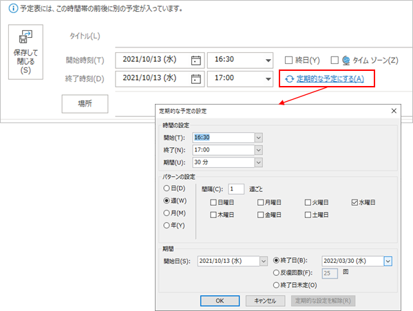

## 概要
Outlook の予定またはタスクで設定できる「繰り返し」について。



参照：[RecurrencePattern object (Outlook) | Microsoft Docs](https://docs.microsoft.com/en-us/office/vba/api/outlook.recurrencepattern)

AppointmentItem または TaskItem で設定できる。
上記2つには IsRecurring(Boolean) プロパティがあり、まずこれで繰り返しのアイテムかどうか確認できる。
繰り返しの詳細は、GetRecurrencePattern メソッドで取得できる。
GetRecurrencePattern または ClearRecurrencePattern メソッドを呼び出すと、IsRecurring プロパティが自動的に変更される。
つまり、何も気にせず GetRecurrencePattern を呼び出すと、IsRecurring が勝手に true になるので注意。

## 繰り返しの予定の作り方
AppointmentItem の GetRecurrencePattern メソッドを呼び出し、繰り返しの設定をする。

参照： [RecurrencePattern object (Outlook) | Microsoft Docs](https://docs.microsoft.com/en-us/office/vba/api/outlook.recurrencepattern)

下記は、現在日時に予定を作成し、2日ごとに3回繰り返しの設定をするサンプル。

```vb
Public Sub Sample()
    Dim oItem As AppointmentItem
    Dim dStart As Date
    Dim dEnd As Date
    Dim recurPattern As RecurrencePattern
    
    
    dStart = Now
    dEnd = DateAdd("h", 1, dStart)
    
    Set oItem = Application.CreateItem(olAppointmentItem)
    oItem.Subject = "繰り返しテスト"
    oItem.Start = dStart
    oItem.End = dEnd
    oItem.ReminderSet = False
    
    ' 2日ごとに3回繰り返す
    Set recurPattern = oItem.GetRecurrencePattern
    recurPattern.RecurrenceType = olRecursDaily
    recurPattern.Interval = 2
    recurPattern.Duration = 3
    
    oItem.Save
    
End Sub
```

## 繰り返しの予定の取得

検索 (Filter や Restrict) を使う場合は、通常の予定の検索と手順は同じ。

検索の手順は下記の通り：

1. Items を Start の昇順で並べ替える。
1. IncludeRecurrences プロパティを true にする。
    1. Items に終了日のない繰り返しの予定があるときに IncludeRecurrences をtrueにすると、Items.Count の値がundefinedになるので注意。
1. Filter や Restrict を使う。

参考：[Items.IncludeRecurrences property (Outlook) | Microsoft Docs](https://docs.microsoft.com/en-us/office/vba/api/outlook.items.includerecurrences)

### 日付を指定して繰り返しの予定を取得

`AppointmentItem.RecurrencePattern().GetOccurrence(DateTime)` メソッドを使うと、
繰り返しの予定のうち、指定した日付の `AppointmentItem` を取得できる。
指定した日に予定がない場合はエラーになる。

    実行時エラー -2147467259 (80004005)

    この定期的なアイテムの 1 回分に変更を加えたので、この回はもう存在しません。開いているアイテムをすべて閉じて、再度実行してください。

引数に指定する日付は、__予定の開始時刻と同時刻でなければいけない__ 。開始時刻が12:00なら、単純に「2020/10/08」と日付だけ指定している下記のサンプルではエラーになる。

```vb
dt = "2020/10/08"
oItem2 = oItem.GetRecurrencePattern().GetOccurrence(dt)
```

時刻もしていすればエラーにならない。

```vb
dt = "2020/10/08 12:00"
oItem2 = oItem.GetRecurrencePattern().GetOccurrence(dt)
```

参考：[vb.net - GetOccurrence always throws exception - Stack Overflow](https://stackoverflow.com/questions/12167921/getoccurrence-always-throws-exception)

