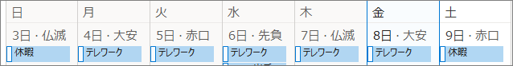
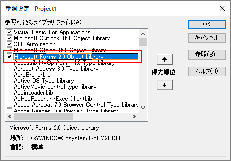
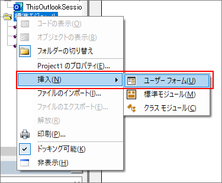

## 当サンプルについて
在宅勤務が始まったころ、部門のルールで、テレワークするか出勤するかを日々チャットツールに連絡することになった。
加えてテレワークの場合は、月初から何回目のテレワークかを添える必要があった(当時は会社がテレワーク率を把握したがっていたため)。

そこで私は、Outlook の予定表に「テレワーク」という件名で予定を登録し、それをマクロで数えるようにした。

↓予定表の例  


毎朝、勤怠連絡するタイミングで下記サンプルマクロを実行すると、下記のような文字列がクリップボードに書き込まれる。

    [勤怠連絡] 10/8 テレワーク (6回目)

これをチャットツールに貼り付けて勤怠連絡に使う。

## 参照設定
クリップボードの操作に使う DataObject を使うには「Microsoft Forms 2.0 Object Library」の参照設定が必要。



手作業でこれを追加してもいいが、ユーザーフォームをマクロに追加するだけでこの参照設定が追加される。



追加したユーザーフォームは、すぐに削除(解放)して問題ない。

## サンプル

```vb
Option Explicit

' 勤怠区分を表す予定の件名
Private Const KINTAI_LIST As String = "テレワーク,通常出勤,休暇"

Public Sub 予定を数える()

    Dim ns As NameSpace
    Dim oFolder As Folder
    
    Dim dt As Date
    Dim kintai As String
    Dim teleCount As Integer
    
    Dim oDo As DataObject
    
    Dim msg As String
    
    
    Set ns = Application.GetNamespace("MAPI")
    Set oFolder = ns.GetDefaultFolder(olFolderCalendar)
    
    ' 今日の予定を取得
    dt = Now
    kintai = GetTodaysKintai(oFolder, dt)
    
    msg = "[勤怠連絡] " & Format(dt, "m/d") & " " & kintai
    
    ' テレワークの時だけ、月初～今日までの回数を数える
    If kintai = "テレワーク" Then
        teleCount = CountTelework(oFolder, dt, kintai)
        msg = msg & " (" & teleCount & "回目)"
    End If
    
    ' クリップボードに書き込む
    Set oDo = New DataObject
    oDo.SetText msg
    oDo.PutInClipboard
    
End Sub

' 今日の予定を取得
'   終日予定のうち、勤怠区分を表す件名と一致するものを取得する
Private Function GetTodaysKintai(ByRef oFolder As Folder, dt As Date) As String
    Dim filter As String
    Dim tomorrow As Date
    Dim oItems As Items
    Dim oItem As AppointmentItem
    Dim kintaiList() As String
    Dim kintaiItem As Variant
    
    
    kintaiList = Split(KINTAI_LIST, ",")
    
    tomorrow = DateAdd("d", 1, dt)
    
    filter = ""
    filter = filter & "[Start] >= '" & Format(dt, "Short Date") + " 00:00'"
    filter = filter & " AND [End] <= '" + Format(tomorrow, "Short Date") + " 00:00'"
    filter = filter & " AND [AllDayEvent] = True"
    
    Set oItems = oFolder.Items.Restrict(filter)
    
    For Each oItem In oItems
        For Each kintaiItem In kintaiList
            If oItem.Subject = kintaiItem Then
                GetTodaysKintai = oItem.Subject
                Exit Function
            End If
        Next
    Next
    
    GetTodaysKintai = ""
    
End Function

' 月初～今日までのテレワークの回数を数える
Private Function CountTelework(ByRef oFolder As Folder, dt As Date, kintai As String) As Integer
    Dim filter As String
    Dim firstDate As Date
    Dim tomorrow As Date
    Dim oItems As Items
    Dim oItem As AppointmentItem
    
    
    firstDate = DateAdd("d", (Day(dt) - 1) * -1, dt)
    tomorrow = DateAdd("d", 1, dt)
    
    filter = ""
    filter = filter & "[Start] >= '" & Format(firstDate, "Short Date") + " 00:00'"
    filter = filter & " AND [End] <= '" + Format(tomorrow, "Short Date") + " 00:00'"
    filter = filter & " AND [Subject] = '" & kintai & "'"
    filter = filter & " AND [AllDayEvent] = True"
    
    Set oItems = oFolder.Items.Restrict(filter)
    
    CountTelework = oItems.Count
    
End Function
```
