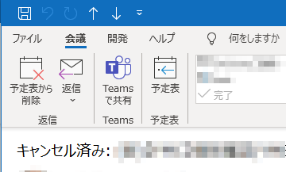

## はじめに
自分以外の人が作成した会議予定がキャンセルされると、「キャンセル済み」とか「Canceled」と件名についたメールが届く。



このサンプルでは、受信トレイに届いたこのメールを一括で処理して、キャンセル済みの予定を予定表から削除する。処理対象は受信トレイに届いていて、未読のもの。マクロを実行した後、処理済みのメールは既読になる。勝手に削除はしないため、削除は手作業で行う必要がある。

キャンセル済みの予定が一度にたくさん届いたときに便利。

```vb
Public Sub キャンセル済みの会議を予定から削除()
    Dim oNs As NameSpace
    Dim oFolder As Folder
    Dim oItems As Items
    Dim oItem As MeetingItem
    Dim oAppo As AppointmentItem
    
    
    Set oNs = Application.GetNamespace("MAPI")
    Set oFolder = oNs.GetDefaultFolder(olFolderInbox)
    
    Set oItems = oFolder.Items.Restrict("[MessageClass] = 'IPM.Schedule.Meeting.Canceled' And [UnRead] = True")
    
    For Each oItem In oItems
        Set oAppo = oItem.GetAssociatedAppointment(False)
        
        If Not oAppo Is Nothing Then
            oAppo.Delete
        End If
        
    Next
    
End Sub
```
