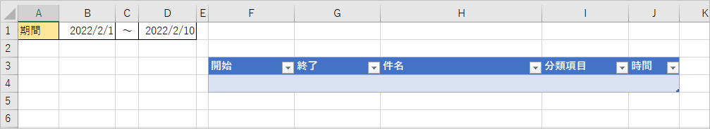
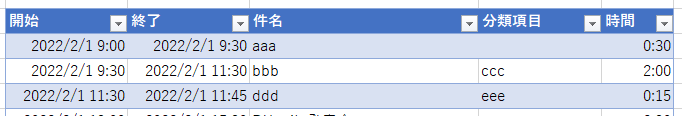

## はじめに
Outlook の予定表を一覧表にして Excel へ出力するサンプル。
処理の主体は Outlook の操作だが、Excel ファイルを作ってそっちに VBA を書いていく。

## Excel ファイルの準備
マクロ有効ブックを作成し、以下のようなシートを作る。



* B1 に名前「期間FROM」を付ける。
* D1 に名前「期間TO」を付ける。
* F3あたりのテーブルの名前を「テーブル1」にする。

シートを作成した後、ページ最後に記載した VBA サンプルをコピーしてマクロを作成する。

## 使い方

1. Outlook を起動しておく。
1. Excel の期間FROMと期間TOに、予定を取得したい日付の範囲を入力する。
1. マクロを実行する。
1. テーブルに予定の一覧が作成される。<br>

## VBA サンプル

```vb
Option Explicit

' 必要参照設定：Microsoft Outlook Object Library

Private Const COL_開始 As Integer = 1
Private Const COL_終了 As Integer = 2
Private Const COL_件名 As Integer = 3
Private Const COL_分類項目 As Integer = 4
Private Const COL_時間 As Integer = 5

' 設定値のRange名
Private Const RANGE_期間FROM As String = "期間FROM"
Private Const RANGE_期間TO As String = "期間TO"


Public Sub 予定一覧作成()

    Dim oList As ListObject
    
    Dim kikanFrom As Date
    Dim kikanTo As Date
    Dim range時間 As Range
    
    
    Set oList = Sheet1.ListObjects(1)
    
    ' 既存データ削除
    If oList.ListRows.Count > 0 Then
        oList.DataBodyRange.Delete xlShiftUp
    End If
    
    ' 期間取得
    kikanFrom = Sheet1.Range(RANGE_期間FROM).Value
    kikanTo = Sheet1.Range(RANGE_期間TO).Value
    
    ' Outlookから予定を取得
    Call GetOutlookAppointments(oList, kikanFrom, kikanTo)
    
    ' 作業時間の計算を追加
    Set range時間 = oList.ListColumns(COL_時間).DataBodyRange
    range時間.Value = "=[@終了]-[@開始]"
    range時間.NumberFormatLocal = "[h]:mm;@"

    MsgBox "書込み完了しました"
    
End Sub

' ------------------------------
' Outlookから指定した期間の予定を取得する
' ------------------------------
Private Sub GetOutlookAppointments(ByRef oList As ListObject, kikanFrom As Date, kikanTo As Date)
    Dim oOutlook As Outlook.Application
    Dim oNs As Outlook.Namespace
    Dim oFolder As Outlook.Folder
    Dim allItems As Outlook.Items
    Dim oItems As Outlook.Items
    Dim oItemWk As Variant
    Dim oItem As Outlook.AppointmentItem
    
    Dim filter As String
    Dim firstDateStr As String
    Dim lastDateStr As String
    
    Dim oRow As ListRow
    
    
    Set oOutlook = New Outlook.Application
    Set oNs = oOutlook.GetNamespace("MAPI")
    Set oFolder = oNs.GetDefaultFolder(olFolderCalendar)
    
    ' 当月の予定をすべて取得 (全日イベントは除外)
    Set allItems = oFolder.Items
    allItems.IncludeRecurrences = True
    allItems.Sort "[Start]"

    firstDateStr = FormatDateTime(kikanFrom, vbShortDate)
    lastDateStr = FormatDateTime(DateAdd("d", 1, kikanTo), vbShortDate)

    filter = "[Start] >= '" & firstDateStr & " 00:00'"
    filter = filter & " AND [Start] <= '" & lastDateStr & " 00:00'"
    filter = filter & " AND [AllDayEvent] = False"

    Set oItems = allItems.Restrict(filter)
    
    ' 取得した予定をExcelへ書き込む
    For Each oItemWk In oItems
        Set oItem = oItemWk
        Set oRow = oList.ListRows.Add
        
        oRow.Range(1, COL_開始).Value = oItem.Start
        oRow.Range(1, COL_終了).Value = oItem.End
        oRow.Range(1, COL_件名).Value = oItem.Subject
        oRow.Range(1, COL_分類項目).Value = oItem.Categories
    Next
    
    Set oNs = Nothing
    Set oOutlook = Nothing
End Sub
```
