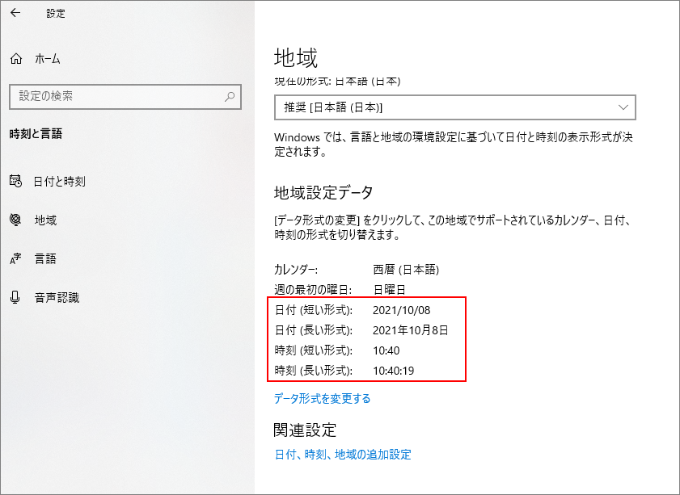

## はじめに
Outlook VBA でメールや予定の検索を行う際、`Items.Find` や `Items.Restrict` を使用する。このメソッドの引数に指定するフィルター構文について分かった部分をまとめた。

参考：
[Filtering Items | Microsoft Docs](https://docs.microsoft.com/en-us/office/vba/outlook/how-to/search-and-filter/filtering-items)

Outlookのバージョン：Office 365

## 基礎知識
フィルターに指定できる構文は、Jet 構文と DASL 構文の2種類がある。
Jet 構文は SQL の WHERE 句のような書き方ができるが、前方一致検索がなかったりする。
DASL 構文には前方一致検索があるが、`Items.Find` と `Items.Restrict` で使用できる構文が一部異なる。

Jet 構文で使用できる列名 (ぽいもの) は、`MailItem` などの Item オブジェクトのプロパティと同じだと思われる。

### Find と Restrict の違い
総じて、Restrict メソッドを使う方がいい。

* `Items.Find`
  * `ci_startswith` など `ci_` で始まる構文が使用できない。「検索操作にコンテンツ インデックス キーワードを使用することはできません。」のエラーになる。
  * 検索条件に含められないプロパティがある。例えば、Body (本文) や Categories (分類項目) が使えない。
  * 検索対象になるアイテム数が少ない場合、Restrict メソッドより実行速度が速い。
* `Items.Restrict`
  * `ci_` から始まる構文の制限なし。
  * 検索対象のアイテム数が多い場合、Find メソッドより実行速度が速い。

## 使用できる演算子
Jet 構文、DASL 構文 いずれも使用できる演算子は同じ。

比較演算子：

* `=`
* `>=`
* `>`
* `<=`
* `<`
* `<>`

論理演算子：

* `And`
* `Or`
* `Not`
  * サンプル：`[FirstName] = 'Jane' And Not([CompanyName] = 'Microsoft')`

## 文字列のフィルター

Jet構文のサンプル：

* `[Subject]='あいう'`
  * 件名が「あいう」に一致する。頭に`RE:`や`FW:`が付いているものも含まれる。

DASL構文のサンプル：

* `@SQL="urn:schemas:httpmail:subject" = 'あいう'`
  * 件名が「あいう」に一致する。頭に`RE:`などが付いていたら対象外。
* `@SQL="urn:schemas:httpmail:subject" like 'RE:%'`
  * 件名が「RE:」で始まる(前方一致)

## 日付のフィルター

日付の書式は、Windows に設定されている書式を使う。



「短い書式」と「長い書式」のいずれでもよいが、フィルター構文では、時刻は「秒」がない書式を使う。秒を含む書式でフィルター構文を書くと、想定通りに動作しない。なので、「短い書式」の方を使うと考えていいと思う。

VBAを使っているなら、Format関数を使えばいい。

```vb
Debug.Print Format(Now, "General Date")
' 2021/10/08 10:36:44 ← 秒が含まれているので後ろ3文字を削除する必要がある

Debug.Print Format(Now,"Short Date") & " " & Format(Now,"Short Time")
' 2021/10/08 11:13
```

また、日付の文字列はシングルクォーテーションで囲む必要がある。Jet構文ではダブルクォーテーションも使えるが、DASL構文ではシングルクォーテーションしか使えないため、常にシングルクォーテーションを使うとよい。

時刻までちゃんと指定しないと、`[Start] >= '2020/06/10 0:00'`としたときに、6月10日0時開始の予定がフィルターに引っかからない。

* `[ReceivedTime] >= '2020/04/15 0:00'`
  * メールの受信日が2020/04/15以降
* `[Start] >= '2020/06/10 0:00' AND [End] <= '2020/06/30 0:00'`
  * 予定の開始日が6/10以降 かつ 終了日が6/30以前

### 予定を日付でフィルターするときの注意
予定 (AppointmentItem) を検索する際、以下のように `IncludeRecurrences` プロパティを true にして、 `Start` プロパティでソートしてから検索する。

```vb
Dim ns As NameSpace
Dim oFolder As Folder
Dim oItems As Items
Dim filter As String


Set ns = Application.GetNamespace("MAPI")
Set oFolder = ns.GetDefaultFolder(olFolderCalendar)

oFolder.Items.IncludeRecurrences = True
oFolder.Items.Sort("[Start]")

filter = "[Start] >= '2021/08/01 0:00' AND [End] <= '2021/08/01 23:59'"
oItems = oFolder.Items.Restrict(filter)
```

こうしないと、8/1にはないはずの「繰り返しの予定」が検索されたりして、上手く検索できない。
詳しい説明は、[MSドキュメントの IncludeRecurrences プロパティのページ](https://docs.microsoft.com/en-us/office/vba/api/outlook.items.includerecurrences) に書かれている。

## Booleanのフィルター

* `[UnRead] = True`
  * メールが未読である
* `[AllDayEvent] = True`
  * 予定が「終日」である

## 列挙型のフィルター
Importance(重要度)などはVBAでは列挙型で指定するが、フィルター構文ではすべて数字へ置き換える。

* `[Importance] = 2`
  * 重要度が「高」である

## 分類項目
Jet 構文では、「XXという分類項目が付いているか」という指定ができる。

```
[Categories] = 'Partner'
```

上記のサンプルでは、`Partner` という分類項目がついているアイテムを検索できる。Partner と Business など、他の分類項目が一緒に付いていても検索結果に表れる。

「`Partner` で始まる分類項目を持つアイテム」を検索したい場合は、DASL クエリを使用する。

```
"urn:schemas-microsoft-com:office:office#Keywords" like 'Partner%'
```

分類項目が一切ついていないアイテムを検索する方法もある。DASL クエリでのみ `IS NULL` という構文が利用できるので、それを使う。

```
"urn:schemas-microsoft-com:office:office#Keywords" is null
```

## MailItem (メール)
検索に使いそうなプロパティを載せておく。

|プロパティ名|型|説明|
|---|---|---|
|Subject|文字|件名|
|SenderEmailAddress|文字|送信者のメールアドレス|
|ReceivedTime|日付|受信日時|
|UnRead|Boolean|未読かどうか|

## AppointmentItem (予定)

|プロパティ名|型|説明|
|---|---|---|
|Subject|文字|件名|
|Start|日付|開始日時|
|End|日付|終了日時|
|AllDayEvent|Boolean|終日かどうか|
|Location|文字|場所|
