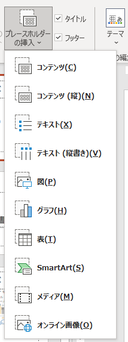

## 参照設定
Excel VBA など PowerPoint 以外から PowerPoint を操作する場合は、下記を参照設定に追加する。

「Microsoft PowerPoint xx.x Object Library」

## ファイルの新規作成
[Application](https://docs.microsoft.com/en-us/office/vba/api/powerpoint.application) オブジェクトの [Presentations.Add](https://docs.microsoft.com/en-us/office/vba/api/powerpoint.presentations.add) メソッドを使う。
PowerPoint の場合、pptx ファイル ＝ [Presentation](https://docs.microsoft.com/en-us/office/vba/api/powerpoint.presentation) オブジェクトになる。

```vb
Dim oApp As PowerPoint.Application
Dim oPres As PowerPoint.Presentation

Set oApp = New PowerPoint.Application
Set oPres = oApp.Presentations.Add()
```

## ファイルを開く
[Presentations.Open](https://docs.microsoft.com/en-us/office/vba/api/powerpoint.presentations.open) メソッドを使う。

```vb
Dim oApp As PowerPoint.Application
Dim oPres As PowerPoint.Presentation

Set oApp = New PowerPoint.Application
Set oPres = oApp.Presentations.Open("C:\test\sample.pptx")
```

## スライドの追加
Presentation.Slides.[AddSlide](https://docs.microsoft.com/en-us/office/vba/api/powerpoint.slides.addslide) メソッドを使う。

```vb
Dim oApp As PowerPoint.Application
Dim oPres As PowerPoint.Presentation
Dim oItem As Variant
Dim oLayout As PowerPoint.CustomLayout


Set oApp = New PowerPoint.Application
Set oPres = oApp.Presentations.Add

For Each oItem In oPres.SlideMaster.CustomLayouts
    Set oLayout = oItem
    
    If oLayout.Name = "タイトルとコンテンツ" Then
        Exit For
    End If
Next

oPres.Slides.AddSlide 1, oLayout

'oPres.Close
'oApp.Quit

Set oApp = Nothing
```

一部のドキュメントのサンプルでは Slides.Add メソッドが使われているが、Office 365 (もしくはそれより前のバージョン) ではこのメソッドは廃止されている。
(無理やり書けば実行されるっぽい)

AddSlide メソッドの第2引数の CustomLayout は、スライドマスタのうちどのスライドを使うか、を指定する。
Presentation.SlideMaster.[CustomLayouts](https://docs.microsoft.com/en-us/office/vba/api/powerpoint.customlayouts) で取得できる。

どの CustomLayout を使うかは、Name プロパティで特定するしかないと思われる。つまり、操作対象の pptx のスライドマスタにあるスライドの名前を知っていないといけない。
名前は、PowerPoint の画面でスライドのレイアウト一覧を表示したときの名前と同じ。


## スライドに書き込む
PowerPoint では、タイトルも本文もまず四角い枠 (プレースホルダー) があって、そこに文字を書き込む。


その四角い枠たちは [Presentation.Shapes](https://docs.microsoft.com/en-us/office/vba/api/powerpoint.slide.shapes) で取得できる。
Shapes には、図形、画像、OLEオブジェクト、テキストオブジェクト、タイトル、ヘッダー＆フッター、スライドNoなどが含まれる。

Shapes は Shape オブジェクトのコレクションで、それぞれどの種類のオブジェクトかは [Shape.Type プロパティ](https://docs.microsoft.com/en-us/office/vba/api/powerpoint.shape.type) で分かる。Type プロパティは [MsoShapeType 列挙体](https://docs.microsoft.com/en-us/office/vba/api/office.msoshapetype) で定義する。
主な値は下記の通り：

* msoPlaceholder (14) ： プレースホルダー。タイトル、サブタイトル、コンテンツなどを入力するところ。
* msoPicture (13) ： 画像。
* msoTextBox (17) ： テキストボックス。
* msoChart (3) ： グラフ。

### プレースホルダー


[Shapes.Placeholders](https://docs.microsoft.com/en-us/office/vba/api/powerpoint.shapes.placeholders) で、スライドにあるプレースホルダーだけ取得できる。
プレースホルダーが、タイトル、コンテンツなどの内どれなのかは、[Shape.PlaceHolderFormat.Type](https://docs.microsoft.com/en-us/office/vba/api/powerpoint.placeholderformat.type) で分かる。


