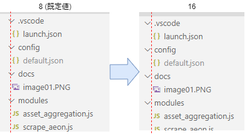

## はじめに
VSCodeの使い方Tips色々

## 設定

### 設定画面を開く
`Ctrl` + `,` を押す。
または、メニューの「ファイル」→「ユーザー設定」→「設定」。

### シングルクリックでファイルが開かないようにする
既定だと、ファイルをシングルクリックするとプレビューモードでファイルが開く(タブのファイル名がイタリックになっている)。
ダブルクリックで普通に開くが、操作しづらいのでプレビューをオフにする。

`Workbench > Editor > Enable Preview` のチェックを外す。

プレビューをオフにしただけだと、シングルクリックでファイルが開くのはそのまま。ダブルクリックでファイルを開くように変更する。

`Workbench > List > OpenMode` を `doubleClick`にする。

### エクスプローラーのインデントを変更する
既定のままだと、エクスプローラーのファイルツリーのインデントが浅いが、このインデントの深さは設定で変更できる。

`Workbench > Tree > Indent` を変更する。

既定値は「8」なので、個人的には「16」などに変更すると良い感じ。  

↓設定値変更前後の様子  


参考：[vs codeでExplorer（ファイルツリー）の階層構造を見やすくする - Qiita](https://qiita.com/toriiico/items/3070bac14946168be1ce)

## ショートカットキー

### Markdownのプレビューを横に表示する
エディタを開いた状態で、`Ctrl` + `K` → `V` を押す(Vを押すときはCtrlキーから手を放す)。

### コードを整形する
`Shift` + `Alt` + `F`

### クイックフィックスを表示する
`Ctrl` + `.`

## 拡張機能

### 日付を挿入する 
Insert Date String (jsynowiec.vscode-insertdatestring)

Ctrl + Shift + I で現在日付を挿入できるようになる。
ブログ記事などの日付を書くときに便利。

### 画像を貼り付ける
Paste Image (mushan.vscode-paste-image)

マークダウンなどを書いているときに Ctrl + Alt + V を押すと、クリップボードにある画像を同フォルダに保存し、マークダウンファイルには画像のリンクを挿入する。
スクリーンショットを撮って、すぐに記事に挿入できるので便利。

## デバッグ

### 開いているファイルをデバッグする
Node.js でデバッグするとき、既定ではプロジェクトルートにある index.js がエントリーポイントになる。
これを、開いているファイルから実行するように変更するには、launch.json の記述を変更する。
下記サンプルのように、program の値を `${file}` へ変更する。

```json
{
	"version": "0.2.0",
	"configurations": [
		{
			"type": "node",
			"request": "launch",
			"name": "プログラムの起動",
			"skipFiles": [
				"<node_internals>/**"
			],
//			"program": "${workspaceFolder}\\index.js"
			"program": "${file}"
		}
	]
}
```

## GitHubのリポジトリを見る
Remote Repositories (github.remotehub)

GitHubのリポジトリをクローンせずに閲覧できる。
2021年6月時点ではまだプレビュー版。

コマンドパレット(F1)で「Remote Repositories: Open Repository」コマンドを実行 → 「Open Repository from GitHub」→ 閲覧したいリポジトリの名前を入力する。
