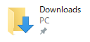
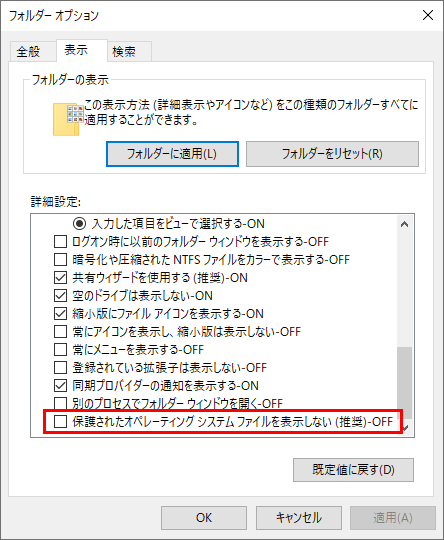

## 現象
Windows 10 のPCを使っていて、ある時からライブラリのフォルダが英語になってしまった。
私の場合は、ダウンロードフォルダが英語になってしまった。



## 原因
私の場合、ダウンロードフォルダにあるファイルを、システムファイルを含めて削除してしまったことが原因だった。

ダウンロードフォルダの名前が日本語が英語になるかは、システムファイル desktop.ini で決まっている。
このファイルはダウンロードフォルダを含めたライブラリフォルダそれぞれの中にある。
普段は表示されておらず、フォルダオプションで「保護されたオペレーティングシステムファイルを表示しない」のチェックを外すと表示される。



ファイル削除に使ったスクリプトは VBS または VBA で、下記の通り。

```vb
delete_file = "C:\Users\xxx\Downloads\*.*"
Set objFS = CreateObject("Scripting.FileSystemObject")
Call objFS.DeleteFile(delete_file)
```

このスクリプトで desktop.ini まで削除してしまった。ちなみにフォルダオプションではシステムファイルを表示しない設定になっていたが、スクリプトには関係なかった。

## 解決策
下記コマンドを、コマンドプロンプトで実行する。

    regsvr32 shell32.dll /i:U

コマンド実行後、PCを再起動すれば直っている。

regsvr32 は、dllをレジストリに登録/削除するコマンド。shell32.dll は Windows に必要な色々が入っている。

もしくは、PC に作った他のユーザーのダウンロードフォルダにある desktop.ini をコピーして、問題のユーザーのダウンロードフォルダに貼り付ける。
こちらも、貼り付けた後 PC を再起動すると直る。

## 再発防止
ライブラリフォルダ直下を、スクリプトで使うようなフォルダにしない。  
または  
フォルダ内のファイルを削除するときは、システムファイルを削除しないようにする。

FileSystemObject を使う場合は、対象フォルダの Files プロパティを参照し、File オブジェクトの [Attributes プロパティ](https://docs.microsoft.com/en-us/office/vba/language/reference/user-interface-help/attributes-property) をチェックしてから削除する。
