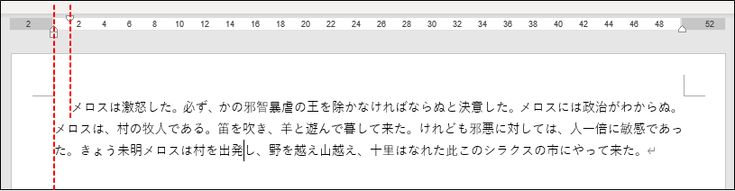
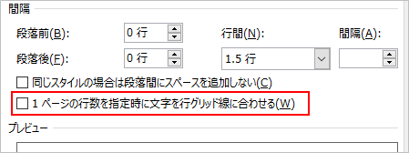

## はじめに
自分なりに確立してきた Word の使い方を記載する。

仕様書や手順書を作る場合、Excel 方眼紙でなんとか頑張るよりは、Word を使う方が適している場合が多い。Excel は表計算ソフトであって、文書作成ソフトは Word なのだから、適材適所である。

なのに Word は使いにくいと評されがちで、エンジニア界隈では Markdown を推す声が強い。個人的には Word の方が優位が点はいくつかあると思う。

* 文書のスタイル設定が最初から行える。Markdown は、ビューアーやPDF出力が必要。
* 文書内に図を作成できる。Markdown 内に図は書けず、別途画像を作成してタグを挿入せねばならない。
* (Office系は差分比較できないと言われがちだが) 文書同士の差分比較機能がある。

この記事で、Word の使い方を知らないだけで「使えない」と評する人が少しでも減れば幸い。

## 初回設定
Word をインストールした直後とか、新しいPC、ユーザーアカウントで初めて Word を使うときにやっておくと良い設定。

### オートコレクトをオフにする
1. 「ファイル」タブ → 「オプション」
1. 「文書校正」 → 「オートコレクトのオプション」ボタン
1. 「オートコレクト」タブのチェックをすべて外す 

固有名詞などを入力するときに、オートコレクトが働いて思うように入力できなかったりするので、スペルミス修正系のオートコレクトはすべてオフにする。
ただスペルミスに全く気づけないのも問題なので、文書校正とスペルチェックはオンにしておく。

### ルーラーを表示する
1. 「表示」タブ → 「ルーラー」のチェックを入れる 

インデント、字下げの位置が分かりやすくなるし、調整がやりやすくなる。

### 編集記号を表示する
1. 「ホーム」タブ → 下記のボタンが押された状態にする。 

タブ、スペース、改ページがあるところが表示されるようになる。

## 新しい文書を作成するとき
まずは、文書の基本のレイアウト、スタイルを決める。先に文書の内容を作って、途中で変えることもできる。

### 標準のフォントの設定
1. 「デザイン」タブ → 「フォント」 → 「フォントのカスタマイズ」
1. 見出しと本文、日本語と英数字それぞれのフォントを指定する 

このフォントが標準のフォントとなり、文書全体のフォントもこれに変わる。

フォントの選び方としては、和文・欧文フォントを使い分けるのがおすすめらしい。

### ページ設定
ページサイズ、向き、余白を設定しておく。

サイズは基本的には A4 縦で問題なし。余白は、印刷しない＆綴じないのであれば「狭い」がおすすめ。

### 標準テンプレートを変更する
フォントやページの余白設定が毎回同じであれば、「標準テンプレート」として保存しておくとよい。標準テンプレートは、新しい文書を作成するときに使われるテンプレート。

標準テンプレートを変更する手順を下記に記載する：

1. 「ファイル」 タブ → 「開く」 をクリック。
1. C:\Users\ユーザー名\AppData\Roaming\Microsoft\Templates を開く。
1. Normal.dotm を開く。
1. フォント、余白、間隔などの設定を変更する。
1. 上書き保存。

標準テンプレートを元に戻したい場合は、Normal.dotm を削除する。次回に Word を起動したときに、既定の Normal.dotm が作り直される。

## 文書を作る

### 見た目は「スタイル」で整える
「ホーム」タブにあるスタイルを使う。

「標準」と「見出し1～n」を主に使う。「見出し」にはアウトラインが設定してあるので、目次に使える。

スタイルを右クリック → 「変更」 を選べば、見た目を変更できる。

この方法で見た目を変更した場合、同じスタイルが適用されている箇所すべてが自動的にその見た目になるので便利。

スタイルは追加も変更もできるので、頻繁に使う書式があるならスタイルを作っておくとよい。

#### スタイルのショートカットキー
以下4つのスタイルにはショートカットキーがある。

|スタイル|ショートカットキー|
|---|---|
|標準|Ctrl + Shift + N|
|見出し1|Ctrl + Alt + 1|
|見出し2|Ctrl + Alt + 2|
|見出し3|Ctrl + Alt + 3|

## 図を書くときは描画オブジェクトを使う
描画オブジェクトとは、複数の図形を一つのグループにまとめるもの。
図を描く枠を確保しつつ、移動や文字の折り返し設定が一括でできるので便利。

## 行間を調整する
行間は意識せずとも既定のままで大体大丈夫だが、フォントによっては (特にメイリオ) 手動で調整しないとイマイチなときがある。

まず、1行あたりの行間は、書式設定の「段落」 → 「行間」で決まっている。「標準」スタイルの既定は「1行」。

これに加えて、行間に影響を与える設定がもう1つある。
ページ設定の「行数」もしくは「行送り」の設定値がそれ。ページ設定は、「レイアウト」タブ → 「ページ設定」の右下をクリック で開く。

この行数が実際どんな感じなのかは、グリッド線を表示すると分かる。

行間の1.5行や2行などは、ページ設定の行の高さが元になっている。

他にも、行間の設定にある「1ページの行数を指定時に文字を行グリッド線に合わせる」にチェックが入っているか入っていないかで行間が変わる。

ただし、行間を固定値で指定すると、常にグリッド線を無視するようになる。一見便利に見えるが、フォントサイズを変えた時などにうまく調整してくれないため、固定値の使用は避けた方がいい。

### メイリオのとき
フォントをメイリオに変更すると、行間が妙に空いてしまう現象が起きる。

これはメイリオのフォントの上下の余白が他より広いことが原因らしい。
これをいい感じにするには、1ページ当たりの行数を減らして行の高さを調整するのが良いと思われる。

ほかにも、グリッド線に合わせるチェックを外すなど行間を狭めるやり方はあるが、グリッド線に合わせる方が総合的には適切な気がする。
