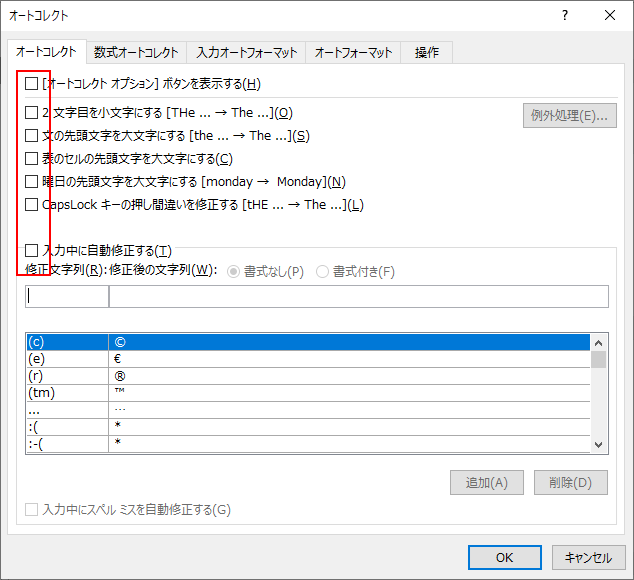
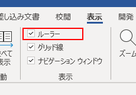
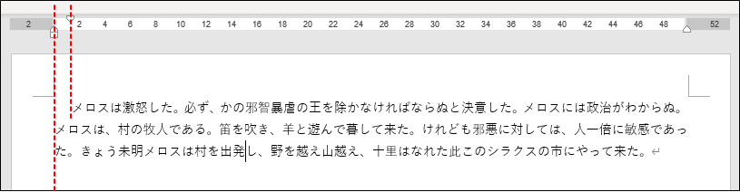

## はじめに
Word をインストールした直後とか、新しいPC、ユーザーアカウントで初めて Word を使うときにやっておくと良い設定。

## オートコレクトをオフにする
1. 「ファイル」タブ → 「オプション」
1. 「文書校正」 → 「オートコレクトのオプション」ボタン
1. 「オートコレクト」タブのチェックをすべて外す 

固有名詞などを入力するときに、オートコレクトが働いて思うように入力できなかったりするので、スペルミス修正系のオートコレクトはすべてオフにする。
ただスペルミスに全く気づけないのも問題なので、文書校正とスペルチェックはオンにしておく。

## ルーラーを表示する
1. 「表示」タブ → 「ルーラー」のチェックを入れる 

インデント、字下げの位置が分かりやすくなる。

## 編集記号を表示する
1. 「ホーム」タブ → 下記のボタンが押された状態にする。 

タブ、スペース、改ページがあるところが表示されるようになる。

