## はじめに
文書作成時の書式設定の色々

## 標準のフォントの設定
1. 「デザイン」タブ → 「フォント」 → 「フォントのカスタマイズ」
1. 見出しと本文、日本語と英数字それぞれのフォントを指定する 

ここで設定したものが文書のテーマのフォントとなり、フォントを選択するリストに表示されたりする。

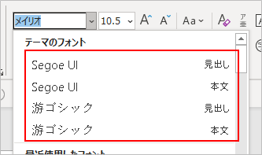

フォントについては、和文・欧文フォントを使い分けるのがおすすめらしい。

## 見た目は「スタイル」を使って整える
「ホーム」タブにあるスタイルを使う。

「標準」と「見出し1～n」を主に使う。「見出し」にはアウトラインが設定してあるので、目次に使える。

スタイルを右クリック → 「変更」 を選べば、見た目を変更できる。

この方法で見た目を変更した場合、同じスタイルが適用されている箇所すべてが自動的にその見た目になるので便利。

## 図を書くときは描画オブジェクトを使う
描画オブジェクトとは、複数の図形を一つのグループにまとめるもの。
図を描く枠を確保しつつ、移動や文字の折り返し設定が一括でできるので便利。

## 表紙を作る
ページ中央にタイトルのある表紙の作り方。

1. 1ページ目に「セクション区切り」を挿入。
    1. 「レイアウト」タブ → 「区切り」 → 「次のページから開始」 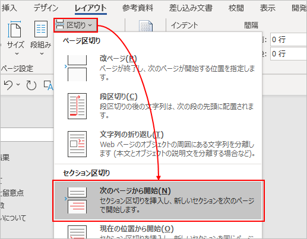
    1. このとき「現在の位置から開始」を選ぶとページの垂直方向の配置を変更できないので注意。
1. 1ページ目のページ設定を変更。
    1. 「レイアウト」タブ → 「ページ設定」右下の矢印をクリック。 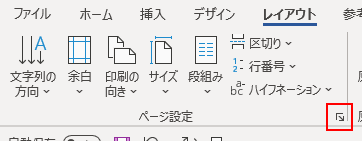
    1. 「その他」タブ → 「垂直方向の配置」で「中央寄せ」を選択。 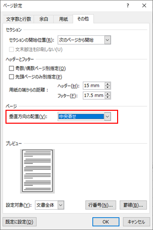
1. 1ページ目だけ文字が垂直方向の中央になる。

セクション区切りを使うと、1つの文書に複数のページ設定を作成できる。例えば、A3、A4を混在させることが可能。

## 行間を調整する
1行あたりの行間は、書式設定の「段落」 → 「行間」で指定する。既定では「1行」。

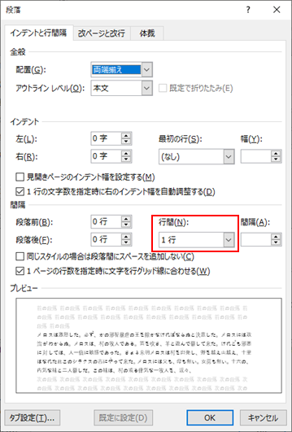

この1行の高さは、ページ設定の「行数」もしくは「行送り」の設定値によって決まっている。

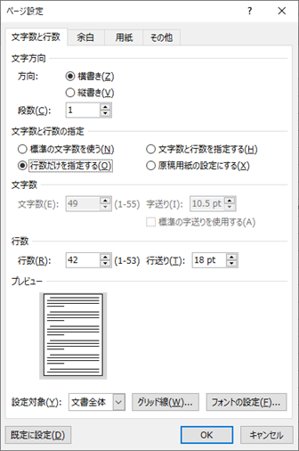

この行の高さが実際どんな感じなのかは、グリッド線を表示すると分かる。

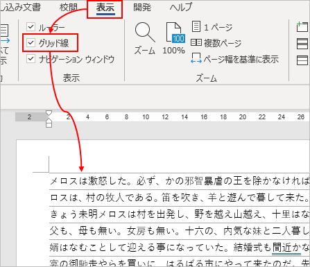

行間の1.5行や2行などは、ページ設定の行の高さが元になっている。

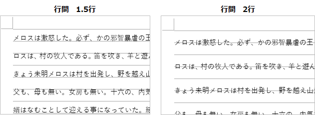

他にも、行間の設定にある「1ページの行数を指定時に文字を行グリッド線に合わせる」にチェックが入っているか入っていないかで行間が変わる。

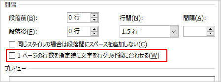

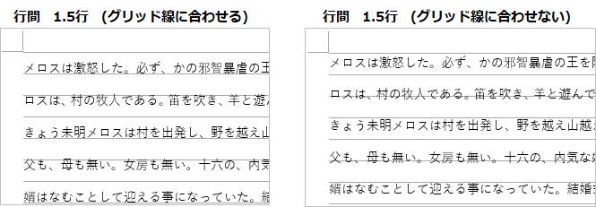

ただし、行間を固定値で指定すると、常にグリッド線を無視するようになる。一見便利に見えるが、フォントサイズを変えた時などにうまく調整してくれないため、固定値の使用は避けた方がいい。

### メイリオのとき
フォントをメイリオに変更すると、行間が妙に空いてしまう現象が起きる。

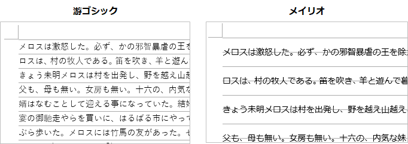

これはメイリオのフォントの上下の余白が他より広いことが原因らしい。
これをいい感じにするには、1ページ当たりの行数を減らして行の高さを調整するのが良いと思われる。

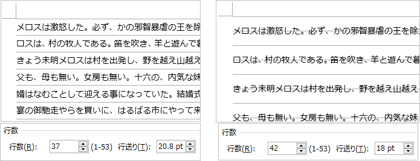

ほかにも、グリッド線に合わせるチェックを外すなど行間を狭めるやり方はあるが、グリッド線に合わせる方が総合的には適切な気がする。
