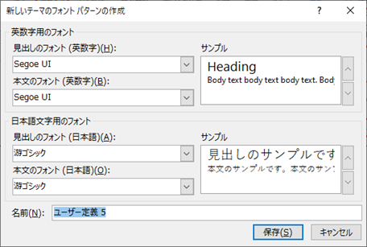
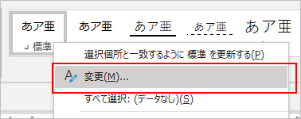

## はじめに
文書作成時の書式設定の色々

## 標準のフォントの設定
1. 「デザイン」タブ → 「フォント」 → 「フォントのカスタマイズ」
1. 見出しと本文、日本語と英数字それぞれのフォントを指定する 

ここで設定したものが文書のテーマのフォントとなり、フォントを選択するリストに表示されたりする。

フォントについては、和文・欧文フォントを使い分けるのがおすすめらしい。

## 見た目は「スタイル」を使って整える
「ホーム」タブにあるスタイルを使う。

「標準」と「見出し1～n」を主に使う。「見出し」にはアウトラインが設定してあるので、目次に使える。

スタイルを右クリック → 「変更」 を選べば、見た目を変更できる。

この方法で見た目を変更した場合、同じスタイルが適用されている箇所すべてが自動的にその見た目になるので便利。

## 図を書くときは描画オブジェクトを使う
描画オブジェクトとは、複数の図形を一つのグループにまとめるもの。
図を描く枠を確保しつつ、移動や文字の折り返し設定が一括でできるので便利。

## 表紙を作る
ページ中央にタイトルのある表紙の作り方。

1. 1ページ目に「セクション区切り」を挿入。
    1. 「レイアウト」タブ → 「区切り」 → 「次のページから開始」 
    1. このとき「現在の位置から開始」を選ぶとページの垂直方向の配置を変更できないので注意。
1. 1ページ目のページ設定を変更。
    1. 「レイアウト」タブ → 「ページ設定」右下の矢印をクリック。 
    1. 「その他」タブ → 「垂直方向の配置」で「中央寄せ」を選択。 
1. 1ページ目だけ文字が垂直方向の中央になる。

セクション区切りを使うと、1つの文書に複数のページ設定を作成できる。例えば、A3、A4を混在させることが可能。

