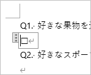

## はじめに
アンケートを集めるなら、Microsoft 365 とか Google のフォーム機能を使えばいい。
しかし、何らかの理由でそれらを使えないときに、Word でアンケートを作って Excel で回収する例を記載する。

端的に書くと、Word のフォームコントロールで入力欄を作り、それを Excel マクロを使って集計するもの。

Office のバージョンは 365 で作っている。

## Word でアンケートを作る

### 「開発」タブを表示する
フォームコントロールは「開発」タブから挿入するが、既定では「開発」タブは表示されていないため、その場合は設定を変更して開発タブを表示する。

1. Wordを起動し、「ファイル」→「オプション」→「リボンのユーザー設定」とクリックする。
1. 右側のリストにある「開発」にチェックを入れ、「OK」を押す。<br>

### アンケートを作る
新しいファイルに設問を書いていく。入力欄は「開発」タブ→「コントロール」から選んで挿入する。


下図は、チェックボックスを挿入した様子。



コントロールを挿入したら、コントロールのプロパティを開き、タイトルを付ける。
後の集計のために、ファイル内で一意になる名前を付けておく。


下図は一通りの設問が作り終わった様子。
入力欄とそれ以外の区別が付きづらいため、入力欄の色を変えておくとよい。


網掛けで背景色を付けると分かりやすいが、色の付け方によって、入力欄に文字を入力したりするとスタイルがリセットされてしまう場合があるので、スタイルを設定した後に入力欄を触ってみて確認しておくと良い。

#### チェックボックスの見た目を変える
既定では、チェックボックスをクリックすると「×」がつく。これをレ点に変えたい場合などは、プロパティで変えられる。


プロパティ画面の「チェックボックスのプロパティ」で「変更」ボタンを押す。


Unicode の 2610 ～ 2612 あたりにある文字を選ぶ。


### 編集を制限する
アンケートが出来上がったら、回答者へ配布する前にファイルを編集から保護しておく。
こうすることで、入力欄以外を編集してしまうことを避ける。

1. 「開発」タブ → 「編集の制限」をクリック。<br>
1. 画面右側に「編集の制限」の画面が出る。「ユーザーに許可する編集の種類を指定する」にチェックを入れ、リストから「フォームへの入力」を選ぶ。そのあと、「はい、保護を開始します」をクリック。<br>
1. パスワードを設定し、OKを押す。<br>

## Excel で集計する
新しい Excel ファイルを作成し、下図のような表を作成する。


列名に、「ファイル名」と、Word ファイルに作った入力欄に付けたタイトルと同じ名前を付ける。

次に、マクロ編集画面 (Visual Basic for Applications) を開き、回答を集めるマクロを作る。

まず、参照設定に「Microsoft Word x.x Object Library」と「Microsoft Scripting Runtime」を追加する。

その後、下記マクロを定義する。

```vb
Option Explicit

Public Sub アンケート結果集計()

    Dim objWord As Word.Application
    Dim objFso As FileSystemObject
    Dim objFolder As Folder
    Dim objFile As File
    Dim docxFolderPath As String
    
    Dim outputList As ListObject
    
    
    Set objWord = New Word.Application
    objWord.Visible = False
    
    Set objFso = New FileSystemObject
    
    ' 結果フォルダパスの取得
    docxFolderPath = ThisWorkbook.Path & "\結果"
    
    ' 結果を集めるテーブルを取得
    Set outputList = Sheet1.ListObjects("テーブル1")
    
    ' リストを空にする
    Do While outputList.ListRows.Count > 0
        outputList.ListRows(1).Delete
    Loop
    
    ' 結果フォルダにあるWordファイルを開く
    If Not objFso.FolderExists(docxFolderPath) Then
        MsgBox "結果フォルダがありません"
        objWord.Quit SaveChanges:=False
        Set objWord = Nothing
        Exit Sub
    End If
    
    Set objFolder = objFso.GetFolder(docxFolderPath)
    
    For Each objFile In objFolder.Files
        Call ファイルごとの処理(objWord, objFile.Path, outputList)
    Next
    
    objWord.Quit
    Set objWord = Nothing
    
    MsgBox "結果を集め終わりました", vbInformation

End Sub

Private Sub ファイルごとの処理(ByRef objWord As Word.Application, filePath As String, ByRef outputList As ListObject)

    Dim objDoc As Word.Document
    Dim objControl As Word.ContentControl
    
    Dim newRow As ListRow
    Dim fileNameIndex As Integer
    

    If LCase(Right(filePath, 4)) <> "docx" Then
        Exit Sub
    End If

    Set objDoc = objWord.Documents.Open(filePath, ReadOnly:=True)
    
    ' リストに1行追加
    Set newRow = outputList.ListRows.Add()
    
    ' ファイル名をリストに追加
    fileNameIndex = GetColumnIndex(outputList, "ファイル名")
    newRow.Range(fileNameIndex) = objDoc.Name

    ' コントロールの値を集める
    For Each objControl In objDoc.ContentControls
        Call コントロールごとの処理(objControl, outputList, newRow)
    Next

    objDoc.Close SaveChanges:=False

End Sub

Private Sub コントロールごとの処理(ByRef objControl As Word.ContentControl, ByRef outputList As ListObject, ByRef newRow As ListRow)
    
    Dim columnIndex As Integer
    
    ' コントロールのタイトルがリストの列にあるか調べる
    columnIndex = GetColumnIndex(outputList, objControl.Title)
    
    If columnIndex < 0 Then
        Exit Sub
    End If
    
    ' コントロールの種類に合わせて値を取得
    If objControl.Type = wdContentControlCheckBox Then
        newRow.Range(columnIndex) = objControl.Checked
    Else
        newRow.Range(columnIndex) = objControl.Range.Text
    End If
    
End Sub

' 列名から列インデックスを取得する
Private Function GetColumnIndex(ByRef outputList As ListObject, columnName As String) As Integer
    Dim objColumn As ListColumn
    
    GetColumnIndex = -1
    
    For Each objColumn In outputList.ListColumns
        If objColumn.Name = columnName Then
            GetColumnIndex = objColumn.Index
            Exit Function
        End If
    Next
    
End Function
```

この Excel ファイルを保存したフォルダに「結果」フォルダを作成し、回答記入済みのアンケートを保存する。

    *
    ├ マクロ.xlsm
    └ 結果
    　├ 回答1.docx
    　├ 回答2.docx
    　└ 回答3.docx

その状態でマクロ「アンケート結果集計」を実行すると、リストに回答が集められる。


あとは、この表を集計したりして結果を分析すればよい。

## おまけ

OneDrive のファイルのパスがURLになるときの回避策。  
[[VBA]OneDriveで同期しているファイルまたはフォルダのURLをローカルパスに変換する関数 | 黒い箱の中](https://kuroihako.com/vba/onedriveurltolocalpath/)
